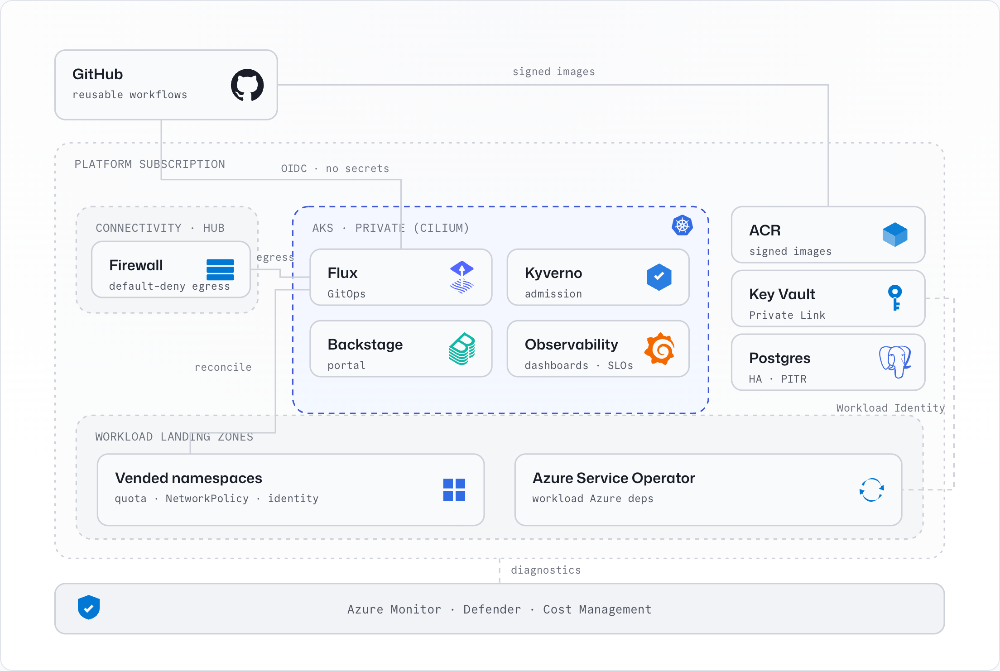

# Azure Platform Engineering Landing Zone

An opinionated, secure, and compliant **Internal Developer Platform (IDP)** for
Azure. It assumes an enterprise **Azure Landing Zone** already exists and turns
ordinary Azure subscriptions into a production-grade paved road — private AKS,
GitOps, a signed software supply chain, observability, FinOps, and a Backstage
developer portal — aligned with the Cloud Adoption Framework, Azure Landing
Zones, and the Well-Architected Framework.

[](https://github.com/edinc/platform-engineering-landing-zone/actions/workflows/ci.yml)
[](https://edinc.github.io/platform-engineering-landing-zone/)
[](LICENSE)
[](docs/how-it-works/README.md)
[](infrastructure/terraform)
[](docs/how-it-works/gitops.md)
[](renovate.json)

> Built for platform engineers who already run an Azure Landing Zone and want a
> reusable, GitOps-driven developer platform on top of it — without owning the
> tenant-wide ALZ.

## What you get

| Capability | Outcome |
| --- | --- |
| Azure foundation | Remote Terraform state, OIDC GitHub deployment identity, seed Key Vault, diagnostics, and break-glass monitoring. |
| Subscription baseline | Activity Log diagnostics, Defender for Cloud posture, budgets, cost exports, and policy validation. |
| Connectivity & egress | Hub/spoke networking, Private DNS, Private Endpoints, and default-deny egress with an exception workflow. |
| Platform shared services | Private AKS, ACR, Key Vault, Service Bus, Container Apps environment, and Postgres. |
| GitOps platform | Flux, cert-manager, external-dns, External Secrets, CSI Key Vault provider, ASO, Kyverno, and KEDA. |
| Supply chain & CI/CD | Reusable workflows, OIDC federation, cosign keyless signing, SBOMs, and vulnerability scanning. |
| Observability, SRE & FinOps | Managed Prometheus/Grafana, OpenTelemetry, SLOs, alerting, and cost showback by team. |
| Developer portal | Backstage with Entra auth, catalog, TechDocs, Kubernetes/Flux/GitHub Actions plugins, RBAC, and Cost Insights. |
| Golden paths | AKS microservice, Azure Container Apps service, and AKS workload namespace templates — CI, signing, SBOMs, SLOs, docs, and ownership wired in. |

## Architecture at a glance

<p align="center">
  <picture>
    <source media="(prefers-color-scheme: dark)" srcset="docs/assets/architecture-dark.png">
    
  </picture>
</p>

- **Identity over secrets** — OIDC federation for CI and Workload Identity for
  workloads; no long-lived cloud credentials are stored.
- **GitOps everywhere** — Flux is the single source of truth for in-cluster
  state, in a separate `platform-cluster-state` repository to limit blast radius.
- **Secure by default** — private clusters, default-deny egress, Private Link,
  signed images verified by Kyverno, and an inherited CIS/ALZ compliance baseline.
- **Hard ownership boundaries** — the ALZ owns management groups; Terraform owns
  subscription and platform infrastructure; Flux owns Kubernetes state; Azure
  Service Operator owns workload Azure dependencies; Backstage only initiates.
- **Self-service** — application teams consume golden paths through Backstage and
  reach a running endpoint without touching the Azure portal.

See the full [architecture reference](docs/architecture/README.md).

## Repository layout

```
platform-engineering-landing-zone/
|- docs/                      Documentation (published to Backstage TechDocs)
|  |- architecture/           Reference architecture
|  |- how-it-works/           How each capability works, end to end
|  |- adr/                    Architecture decision records
|  |- runbooks/               Day-2 operational procedures
|  |- contracts/              Public request schemas (vending, onboarding)
|  \- roadmap/                Delivered capabilities and future options
|- infrastructure/terraform/
|  |- _bootstrap/             Azure foundation: state, OIDC, seed Key Vault
|  |- _modules/               Reusable, AVM-aligned modules
|  |- subscription-baseline/  Subscription baseline
|  |- connectivity/           Connectivity & egress
|  |- identity/               Entra groups, PIM, RBAC
|  |- platform/               Platform shared services (AKS/ACR/KV/Postgres)
|  |- vending/                Subscription & namespace vending compositions
|  \- envs/{demo,nonprod,prod}/  Per-profile composition
|- platform-gitops/           Pointer + bootstrap for the cluster-state repo
|- backstage/                 Backstage app, Helm, and plugins
|- templates/                 Golden-path software templates
|- workflows/ & .github/      Reusable GitHub Actions workflows
|- policies/                  Azure Policy + Kyverno bundles
\- scripts/                   Bootstrap and validation tooling
```

Cluster *state* lives in a separate Flux-watched `platform-cluster-state`
repository, by design — see the [GitOps guide](docs/how-it-works/gitops.md).

## Getting started

The platform deploys in a fixed **dependency order**. Each step links to the
how-it-works guide that explains it and the runbook that operates it.

### Prerequisites

- An Azure subscription placed under your existing ALZ, where you hold **Owner**
  (to create role assignments) and **Global Administrator** in Entra ID (for the
  bootstrap app registration).
- [`mise`](https://mise.jdx.dev/) for the pinned toolchain (Terraform, kubectl,
  Helm, Flux, cosign, Azure CLI, and friends — see [`.tool-versions`](.tool-versions)),
  or use the provided devcontainer.
- `az`, `gh`, and `jq` available locally.

### 1. Clone and install the toolchain

```bash
git clone https://github.com/edinc/platform-engineering-landing-zone.git
cd platform-engineering-landing-zone
mise install        # or open the devcontainer
make bootstrap      # installs pre-commit hooks and local quality gates
```

### 2. Bootstrap the Azure foundation (secret zero)

Establish remote state, the OIDC deployment identity, and the seed Key Vault so
every later step deploys from GitHub Actions with **no long-lived secrets**.

```bash
make bootstrap-init ARGS="--subscription-id <sub> --tenant-id <tenant> --name-suffix <suffix>"
# wire the printed values onto the 'bootstrap' GitHub Environment, then:
make bootstrap-tf-init
make bootstrap-import
```

Run the **Bootstrap Azure foundation** workflow (`plan`, then `apply`).
Full walkthrough: [foundation](docs/how-it-works/foundation.md) ·
[bootstrap runbook](docs/runbooks/bootstrap.md).

### 3. Choose an environment profile

Select `demo`, `nonprod`, or `prod` under
[`infrastructure/terraform/envs/`](infrastructure/terraform). `demo` is
cost-optimized; `prod` is HA and production-hardened (see [Profiles](#profiles)).

### 4. Deploy the platform, in order

The ordering below is a set of **dependencies**, not a schedule:

1. **Subscription baseline** — Defender, diagnostics, budgets, tags.
   ([guide](docs/how-it-works/foundation.md) · [runbook](docs/runbooks/subscription-onboarding.md))
2. **Connectivity & egress** — must exist *before* platform services so AKS has a
   defined egress policy.
   ([guide](docs/how-it-works/connectivity-egress.md) · [runbook](docs/runbooks/egress-exception.md))
3. **Platform shared services** — private AKS, ACR, Key Vault, Postgres.
   ([guide](docs/how-it-works/platform-services.md) · [runbook](docs/runbooks/aks-baseline.md))
4. **Supply chain & CI/CD** — must exist *before* GitOps and the portal, which are
   built and deployed by this pipeline.
   ([guide](docs/how-it-works/supply-chain-cicd.md) · [runbook](docs/runbooks/release.md))
5. **GitOps platform** — Flux owns in-cluster state from the cluster-state repo.
   ([guide](docs/how-it-works/gitops.md) · [runbook](docs/runbooks/flux-extension-recovery.md))
6. **Developer portal** — Backstage, golden paths, and namespace vending.
   ([guide](docs/how-it-works/developer-portal.md) · [runbook](docs/runbooks/backstage-ops.md))

### Validate locally

```bash
make lint validate policy-test-rego policy-test-kyverno
```

## Profiles

| Profile | Intent | Posture |
| --- | --- | --- |
| `demo` | Low-cost evaluation | NAT Gateway (no Firewall Premium), Defender free, ACR Standard, single-AZ Postgres, public Backstage ingress. |
| `nonprod` | Pre-production validation | Production-shaped with reduced redundancy and relaxed cost controls. |
| `prod` | Production | Zone-redundant, Defender standard, Premium ACR, HA Postgres with PITR, default-deny egress, DR secondary region. |

## Documentation

- [Architecture](docs/architecture/README.md) — component view, ownership
  boundaries, profiles, and trust posture.
- [How it works](docs/how-it-works/README.md) — end-to-end flow of every
  capability.
- [Architecture decision records](docs/adr/README.md) — the trade-offs behind
  the design.
- [Runbooks](docs/runbooks/README.md) — day-2 operations and recovery.
- [Roadmap](docs/roadmap/README.md) — delivered capabilities and future options.

## Security and contributing

- Report vulnerabilities via the process in [`SECURITY.md`](SECURITY.md) — please
  do not open public issues for security reports.
- Contributions are welcome; start with [`CONTRIBUTING.md`](CONTRIBUTING.md) and
  the [Code of Conduct](CODE_OF_CONDUCT.md).
- Licensed under the [MIT License](LICENSE).

Never commit secrets, tenant IDs, subscription IDs, generated kubeconfigs, or
Terraform state.
