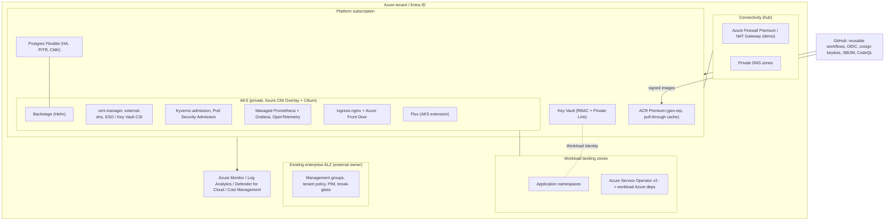
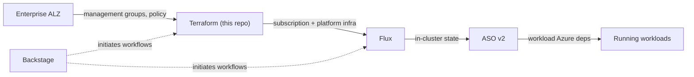

# Architecture

This is the reference architecture for the Azure Platform Engineering Landing
Zone: an opinionated, secure, and compliant Internal Developer Platform (IDP)
that turns existing Azure subscriptions into a production-grade paved road for
application teams.

It assumes an enterprise **Azure Landing Zone (ALZ)** already exists and owns the
management-group hierarchy and tenant-wide policy. This platform onboards
subscriptions *underneath* that foundation and operates the shared services,
delivery pipelines, GitOps, and developer portal on top.

- For the *flow* of each capability, see the [how-it-works guides](../how-it-works/README.md).
- For the decisions behind the design, see the [ADRs](../adr/README.md).
- For day-2 procedures, see the [runbooks](../runbooks/README.md).

## Component view

## Ownership boundaries

The platform has deliberate, hard ownership boundaries. Each layer of desired
state has exactly one owner, which keeps blast radius small and prevents two
systems from fighting over the same resource.

| Owner | Owns | Does **not** own |
| --- | --- | --- |
| Existing enterprise ALZ | Management groups, tenant/MG-scoped policy, subscription placement | Subscription-scoped baseline, platform infrastructure |
| Terraform (this repo) | Subscription baseline, connectivity, identity, platform shared services, vending compositions | Kubernetes in-cluster state, workload Azure dependencies |
| Flux (cluster-state repo) | In-cluster Kubernetes desired state (add-ons, controllers, tenant manifests) | Azure control-plane resources |
| Azure Service Operator v2 | Workload-team Azure dependencies requested from inside the cluster | Platform shared infrastructure |
| Backstage | *Initiating* golden-path workflows and surfacing catalog/state | Being a source of truth for any resource |

Two repositories implement this split so that a bad cluster change can never
take down the platform's Terraform state, and vice versa:

- **This repository** holds platform *code*: Terraform modules and compositions,
  reusable CI/CD workflows, Backstage app and templates, policy bundles, and
  documentation.
- **A separate `platform-cluster-state` repository** holds cluster *state*,
  watched by Flux. Application teams receive vended manifests there.

## Layered capabilities

The platform is organized as layered capabilities. Higher layers depend on the
ones below them; this is a dependency order, not a delivery schedule.

| Layer | Capability | Summary |
| --- | --- | --- |
| L0 | Tenant & identity | Entra tenant, PIM, platform groups, break-glass. |
| L1 | Subscription baseline | Subscription Activity Logs, Defender, tag expectations, budgets, cost exports. |
| L2 | Connectivity & egress | Hub VNet, Azure Firewall Premium, Private DNS, default-deny FQDN allowlist, Private Link, exception workflow. |
| L3 | Platform shared services | AKS, ACR (+ pull-through cache), Key Vault, Postgres, ingress, DNS, eventing. |
| L4 | In-cluster platform (Flux GitOps) | cert-manager, external-dns, Workload Identity + CSI/ESO, Kyverno, PSA, Managed Prometheus/Grafana, OpenTelemetry. |
| L5 | Supply chain & CI/CD | Reusable workflows, OIDC federation, cosign keyless, SBOM, scanning, image promotion, base-image governance. |
| L6 | Observability, SRE, FinOps | OpenTelemetry, dashboards, SLO toolkit, alert routing, runbooks, cost allocation, node auto-provisioning. |
| L7 | Developer portal | Backstage with Entra auth, catalog, TechDocs, scaffolder, Kubernetes/Flux/GitHub Actions plugins. |
| L8 | Multi-tenancy & onboarding | Team/product onboarding, namespace vending, Backstage RBAC, ownership matrix, cost showback. |
| L9 | Golden paths | AKS microservice, ACA service, and AKS workload namespace templates. |
| L10 | Reliability operations | DR drills, status page, post-mortems, incident workflow. |
| L11 | Roadmap & future options | Platform CLI/API, Bicep optionality, Radius, Dapr, AI/ML paths, multi-region. |

Each capability is explained in its own [how-it-works guide](../how-it-works/README.md).

## Environment profiles

The same code targets three profiles, selected through Terraform variable sets,
so the platform is approachable at low cost yet production-capable at full tier.

| Profile | Intent | Posture |
| --- | --- | --- |
| `demo` | Low-cost evaluation | NAT Gateway instead of Firewall Premium, Defender free tier, ACR Standard, single-AZ Postgres, public Backstage ingress for access. |
| `nonprod` | Pre-production validation | Production-shaped with reduced redundancy and relaxed cost controls. |
| `prod` | Production | Zone-redundant where supported, Defender standard, Premium ACR, HA Postgres with PITR, default-deny egress, secondary region as DR target. |

## Trust and network posture

Security defaults are not optional add-ons; they are the baseline every profile
inherits (the `demo` profile relaxes cost-driven SKUs, not the security model).

- **Identity over secrets.** GitHub authenticates to Azure with OIDC federation;
  workloads use Workload Identity. No long-lived cloud credentials are stored.
- **Private by default.** Private AKS API server, Private Link for Key Vault,
  ACR, and Postgres, and Private DNS for resolution.
- **Default-deny egress.** Outbound traffic flows through the hub firewall with
  an FQDN allowlist; additions go through a time-bound exception workflow.
- **Signed, scanned supply chain.** Images are signed with cosign keyless and
  verified in-cluster by Kyverno; SBOMs and vulnerability scans gate releases.
- **Single admission engine.** Kyverno is the one in-cluster admission and
  mutation engine; the Azure Policy Gatekeeper add-on is intentionally not used.
- **Compliance baseline.** Inherited CIS/ALZ policy posture, Defender for Cloud,
  required tags, and central diagnostics are preserved on every onboarded
  subscription.

See [security & compliance](../how-it-works/security-compliance.md) for the full
posture and the [connectivity & egress](../how-it-works/connectivity-egress.md)
guide for the network model.

## Tagging taxonomy

Every Azure resource carries a mandatory tag set, enforced by Azure Policy and
checked at plan time by the OPA/Rego policies. The taxonomy is the canonical
contract for environment isolation, ownership, and cost allocation.

| Tag | Example | Purpose |
| --- | --- | --- |
| `env` | `prod`, `nonprod`, `demo` | Environment isolation |
| `owner` | `team-payments` | Ownership / on-call |
| `costCenter` | `cc-12345` | FinOps chargeback |
| `product` | `checkout` | Product cataloguing |
| `dataClassification` | `public`, `internal`, `confidential`, `restricted` | Compliance |
| `confidentiality` | `low`, `medium`, `high` | Risk posture |
| `managedBy` | `terraform`, `flux`, `aso`, `manual` | Ownership boundary |
| `repo` | `org/repo` | Source-of-truth link |

## Where to go next

- Start with the [how-it-works guides](../how-it-works/README.md) for the
  end-to-end flow of each capability.
- Read the [ADRs](../adr/README.md) for the trade-offs behind each decision.
- Use the [runbooks](../runbooks/README.md) to operate the platform.
- See the [roadmap](../roadmap/README.md) for delivered capabilities and future
  options.
