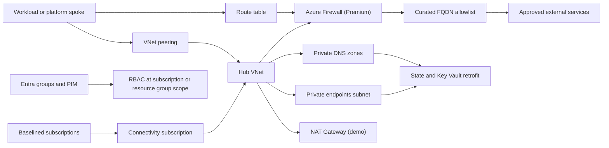
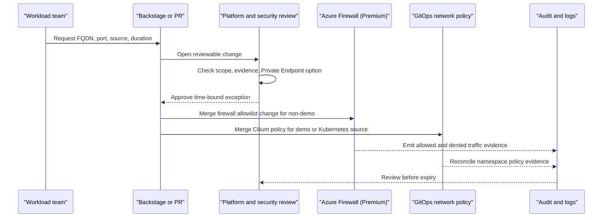

# Connectivity & egress

Connectivity & egress is the network and identity control layer that lets platform and workload subscriptions consume shared private services safely. It creates a regional hub, centralizes Private DNS, establishes default-deny outbound traffic, and defines how operators receive time-bounded access.

The capability starts after [Azure foundation](./foundation.md) has created state, OIDC, and subscription readiness. Its private endpoints and DNS enable a later reviewed bootstrap change to close the temporary public access used during secret zero, and its outputs feed [Platform shared services](./platform-services.md).

## How it works

The flow has three linked parts:

1. The connectivity stack runs in the connectivity subscription after the subscription baseline is ready.
2. Terraform creates a regional hub VNet with reserved subnets for gateway, firewall, private endpoints, shared services, and optional firewall management when forced tunneling is enabled.
3. Private DNS zones are created centrally for the MVP private services, including Key Vault, ACR, Storage blob and DFS, PostgreSQL Flexible Server, AKS API, and Service Bus. Azure Monitor DNS and AMPLS are enabled only when approved monitor resources are supplied.
4. Platform and workload spokes peer to the hub through later vending or platform compositions.
5. For `nonprod` and `prod`, route tables send default outbound traffic from workload subnets to Azure Firewall Premium.
6. Firewall policy denies unmatched outbound traffic and allows only curated FQDNs needed by Azure control plane, registries, GitHub, package ecosystems, base OS mirrors, and Sigstore.
7. For `demo`, NAT Gateway provides outbound connectivity without Azure-layer FQDN filtering. Fine-grained demo enforcement depends on the planned Cilium FQDN-aware policy path being explicitly enabled and tested; base AKS Cilium L3/L4 network policy is not enough.
8. Every PaaS service is expected to use Private Endpoint access, with public network access disabled by policy where the ALZ baseline enforces it.
9. The connectivity stack retrofits the state account and seed Key Vault from the foundation flow by adding private endpoints and DNS; private-only operation also needs a reviewed bootstrap change after private access and runner reachability are proven.
10. Identity Terraform creates Entra groups, PIM activation policies, custom roles, and group-based RBAC assignments at subscription or resource group scope.
11. Operators activate time-bounded privileges through PIM instead of holding standing broad access.
12. Egress exceptions are requested, reviewed, implemented as code, audited, and removed on expiry.

## Key components

| Component | How it works |
| --- | --- |
| Hub VNet | Regional hub in the connectivity subscription. It centralizes egress, DNS, private endpoint placement, and future gateway integration. |
| `GatewaySubnet` | Reserved for future VPN or ExpressRoute integration. It is documented but not deployed as a full hybrid network in the MVP. |
| `AzureFirewallSubnet` | Hosts Azure Firewall Premium for `nonprod` and `prod`. |
| `AzureFirewallManagementSubnet` | Created only when forced tunneling is enabled. |
| `private-endpoints` subnet | Hosts Private Endpoints, including the retrofit endpoints for the state account and seed Key Vault. |
| `shared-services` subnet | Reserved for shared network services that need hub placement. |
| Azure Firewall Premium | Central FQDN-aware egress control for `nonprod` and `prod`; unmatched outbound traffic is denied. |
| NAT Gateway | Cost-conscious `demo` outbound path. It does not provide Azure-layer FQDN filtering. |
| Firewall allowlist | `policies/azure/firewall/allowlist.json` stores curated platform dependencies and is validated so required endpoints are not removed accidentally. |
| Route tables | Workload subnets route `0.0.0.0/0` through the firewall for non-demo profiles. |
| Private DNS zones | Hub-owned zones are linked to hub and spokes so Private Endpoint names resolve consistently. |
| AMPLS | Optional Azure Monitor Private Link Scope enables private observability ingestion and query paths when `enable_monitor_private_link_scope` and approved linked resources are supplied. |
| Private Endpoint standard | PaaS resources use Private Endpoints and policy-driven public network access restrictions where applicable. |
| State and vault retrofit | Adds private endpoints and private DNS, and requires VNet-integrated runner reachability before a later bootstrap change removes just-in-time public runner allowlisting and disables public access. |
| Entra platform groups | `pe-platform-admins`, `pe-platform-operators`, `pe-platform-readers`, and team groups provide group-based access boundaries. |
| Custom Platform Operator role | Allows operational repair without default IAM mutation powers. |
| PIM policy | Time-bounds privileged activation, requires MFA and justification, and requires approval for production. |
| Egress exception workflow | Converts new outbound needs into reviewed firewall and network policy changes with expiry. |

### Profiles

| Profile | Connectivity and egress behavior |
| --- | --- |
| `demo` | Uses NAT Gateway only. Fine-grained FQDN governance is not provided by NAT Gateway; it requires the planned Cilium FQDN-aware policy path to be enabled and tested, not base AKS Cilium L3/L4 policy alone. |
| `nonprod` | Uses Azure Firewall Premium, hub/spoke routing, Private DNS, Private Endpoints, and default-deny outbound traffic with reviewed exceptions. |
| `prod` | Uses the same non-demo controls with stricter PIM approval, shorter production egress exception durations, and stronger review expectations. |

DDoS Network Protection is not enabled by default for any profile in the MVP. Public IPs receive Azure platform DDoS Basic protection, and Network Protection is revisited when public tier-0 workload requirements justify the cost and operational model.

## Decisions

| Decision | Governing ADR |
| --- | --- |
| The MVP uses regional hub-and-spoke networking rather than Virtual WAN. | [ADR-0030: Hub-and-spoke networking for MVP](../adr/0030-hub-and-spoke.md) |
| Non-demo outbound traffic is default-deny through Azure Firewall Premium with a curated FQDN allowlist. | [ADR-0031: Default-deny egress and FQDN allowlist](../adr/0031-default-deny-egress.md) |
| Subscription placement and moves remain outside this repository; this capability consumes baselined subscriptions. | [ADR-0028: Subscription topology and ALZ ownership boundary](../adr/0028-subscription-topology.md) |
| RBAC created by this repository uses groups, custom roles, and PIM instead of direct user assignments. | [ADR-0029: Custom RBAC roles and group-only assignments](../adr/0029-custom-roles.md) |
| State and seed Key Vault access moves from just-in-time public IP allowlisting to Private Endpoints and private runners. | [ADR-0048: Runner connectivity model](../adr/0048-runner-connectivity.md) |
| DDoS Network Protection is deferred until a public tier-0 or regulated production trigger appears. | [ADR-0049: DDoS protection posture](../adr/0049-ddos-protection.md) |

## Operate it

| Runbook | Use it for |
| --- | --- |
| [Egress exception workflow](../runbooks/egress-exception.md) | Requesting and implementing time-bound outbound access through firewall allowlist and Kubernetes network policy changes. |
| [Region support matrix](../runbooks/region-matrix.md) | Confirming regional support for features that depend on private networking, zones, AKS Cilium, ACR cache, or private ingress. |
| [Bootstrap and secret zero](../runbooks/bootstrap.md) | Understanding the state account and Key Vault private endpoint retrofit that connectivity must complete. |
| [Policy exception](../runbooks/policy-exception.md) | Handling Azure Policy exemptions when inherited policy blocks a legitimate temporary network requirement. |

Operate connectivity as a shared control point, not as per-team plumbing:

1. Keep hub route tables, Private DNS links, and firewall policy changes in Terraform.
2. Prefer Private Endpoint or Azure-native integration before granting public egress.
3. Keep FQDN rules narrow; avoid broad wildcard domains unless approved as an explicit high-risk exception.
4. Confirm firewall logs or Cilium evidence after any egress exception is applied.
5. Review active exceptions monthly and remove expired firewall collections and network policies.
6. Confirm all repository-created RBAC assignments are group based.
7. Treat production PIM activation as an auditable support event.
8. Update the regional matrix before changing default regions or enabling a profile that needs zonal support.
9. Prove private endpoint and runner reachability before implementing the reviewed bootstrap change that disables public state and Key Vault access.
10. Pass the hub DNS and egress outputs forward to [Platform shared services](./platform-services.md).
