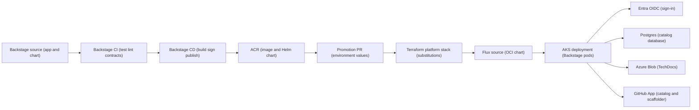
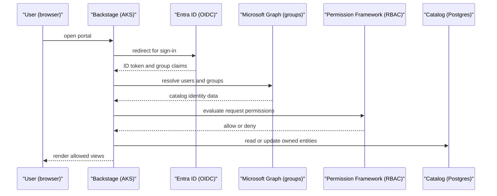
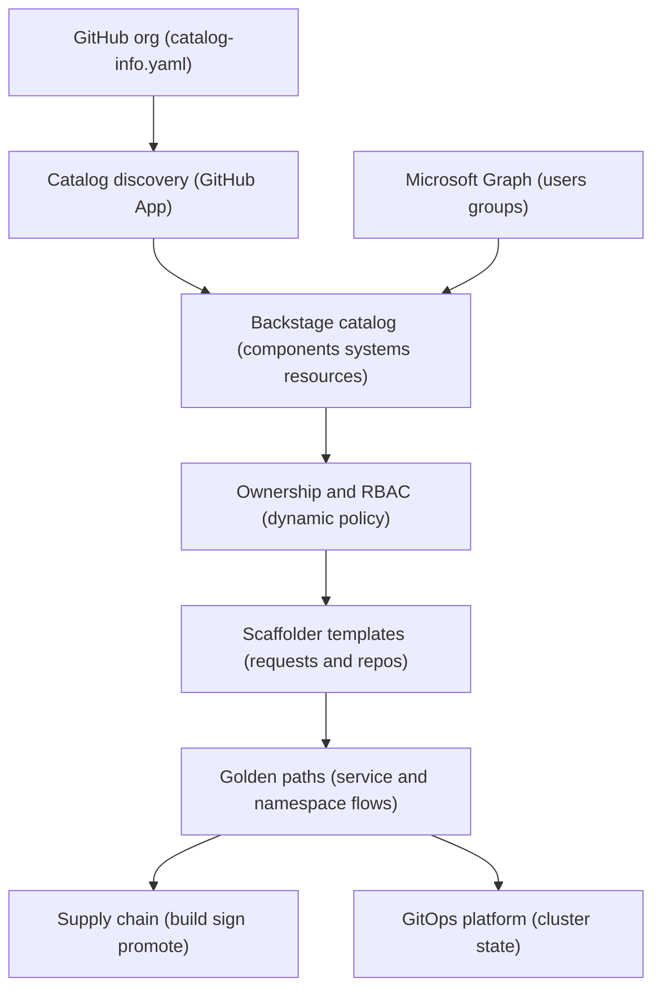

# Developer portal

Developer portal is the Backstage-based entry point for platform users. It ties catalog ownership, TechDocs, Kubernetes visibility, GitHub workflows, Cost Insights, RBAC, and scaffolder workflows into a single UI while keeping Git, Terraform, Flux, and Azure as the durable sources of truth.

Backstage is not a special deployment path. The platform builds, signs, publishes, promotes, and reconciles Backstage through its own [supply chain & CI/CD](./supply-chain-cicd.md) and [GitOps platform](./gitops.md) capabilities.

## How it works

1. The Backstage application lives under `backstage/app` and the Helm deployment contract lives under `backstage/deploy`.
2. Backstage CI tests the app and chart and validates contracts on PRs; Backstage CD then builds the image, publishes the Helm chart, signs artifacts, and writes the immutable digests expected by the platform configuration when the platform is online.
3. Promotion updates environment-specific digest and chart values through the protected platform workflow path.
4. Terraform owns Azure resources, managed identities, federated credentials, runtime configuration, TechDocs storage, and public demo ingress Azure primitives; Flux and Helm own the Kubernetes deployment, service accounts, ingress objects, and runtime state.
5. Flux consumes the signed Helm chart from ACR and reconciles Backstage into the platform AKS cluster.
6. Backstage runs with Workload Identity and reads runtime secrets from the platform Key Vault path exposed through External Secrets or CSI.
7. Users sign in with Microsoft Entra ID through OIDC.
8. The Backstage backend resolves users and groups from Microsoft Graph and applies dynamic permission policy decisions.
9. Catalog discovery, TechDocs reads, Kubernetes reads, GitHub workflow views, Flux views, and Cost Insights all use scoped identities instead of long-lived kubeconfigs or account keys.

The portal is configuration-first. The MVP intentionally uses community UI plugins and keeps custom plugin development out of the main path. Cost Insights uses the community UI with a small platform-owned showback adapter for Azure CSV data.

### Catalog and golden path flow

1. GitHub discovery scans approved repositories for `catalog-info.yaml` files.
2. User and group identities come from Microsoft Graph or platform-owned configuration, not from arbitrary repository writers.
3. Catalog entities carry lifecycle, owner, source-location, Kubernetes, and coexistence annotations.
4. The catalog reconciler compares Backstage components, vended namespaces, and repositories and reports drift.
5. RBAC decides whether a user can read, edit, delete, or run scaffolder workflows.
6. Scaffolder templates link to [golden paths](./golden-paths.md) and create reviewed requests or repositories instead of mutating production state directly.
7. Generated services inherit supply-chain workflows, TechDocs publishing, SLOs, dashboards, cost tags, and ownership metadata.

## Key components

| Component | How it works |
| --- | --- |
| `backstage/app` | Configuration-first Backstage application, catalog seed, Docker build contract, and validation script. |
| `backstage/deploy` | Helm chart published to ACR as an OCI chart and reconciled by Flux. |
| `backstage/catalog-reconciler` | CronJob that detects drift between catalog entities, vended namespaces, and GitHub repositories. |
| `backstage/plugins/cost-insights-azure` | Adapter helpers that translate platform showback CSV data into the Cost Insights plugin API. |
| Backstage backend | Runs in AKS with Workload Identity and no stored kubeconfigs. |
| PostgreSQL Flexible Server | Stores Backstage catalog and runtime data through the shared managed database service. |
| Azure Blob TechDocs container | Stores published static TechDocs behind private networking and Azure RBAC. |
| Dedicated Backstage GitHub App | Reads catalog locations and templates and executes scaffolder actions. |
| Entra ID OIDC | Authenticates users into Backstage. |
| Microsoft Graph provider | Ingests users and groups for identity-backed catalog and RBAC. |
| Permission Framework | Resolves permissions dynamically from configured Entra group mappings. |
| Kubernetes plugin | Reads AKS state using Backstage Workload Identity and Azure/Kubernetes read permissions. |
| GitHub Actions plugin | Shows workflow status for owned repositories. |
| Flux plugin | Shows GitOps reconciliation state. |
| TechDocs plugin | Serves CI-published documentation from Azure Blob Storage. |
| Cost Insights plugin | Displays team and product showback data through the community UI and platform showback backend. |
| Scaffolder plugin | Starts reviewed onboarding and golden-path workflows. |

### Identity and access model

| Access path | Identity used | Boundary |
| --- | --- | --- |
| User sign-in | Microsoft Entra OIDC app | Browser access and user session. |
| User and group ingestion | Backstage workload identity service principal with Graph read roles | Identity catalog; repository writers cannot mint privileged users or groups. |
| Kubernetes reads | Backstage workload identity with AKS user and reader permissions | No long-lived kubeconfig in Backstage. |
| TechDocs reads | Backstage workload identity with Blob Data Reader | Portal can read published docs but cannot publish them. |
| TechDocs writes | Supply-chain workflow identities with Blob Data Contributor | CI publishes docs; Backstage serves docs. |
| Catalog and scaffolder GitHub access | Dedicated Backstage GitHub App | Separate from the vending bot and scoped to portal work. |
| Database access | Preferred Entra token through Workload Identity; password fallback from Key Vault | Passwordless is the target path; fallback remains rotatable. |

### Plugin surface

| Plugin | Purpose |
| --- | --- |
| Kubernetes | Shows workloads for catalog components with correct annotations and RBAC. |
| GitHub Actions | Shows CI and workflow status. |
| Flux | Shows GitOps reconciliation status. |
| TechDocs | Serves documentation published by CI. |
| Scaffolder | Starts templates for tenancy, services, and golden paths. |
| Cost Insights | Shows allocated Azure spend by team and product. |
| Permission backend | Enforces RBAC decisions and auditability. |

### Profiles

| Profile | Behavior |
| --- | --- |
| `demo` | Can enable a dedicated public Backstage-only ingress. Internet access reaches only the public controller path and still requires Entra sign-in plus Backstage RBAC. |
| `nonprod` | Runs the private portal path with at least two replicas where HA is enabled and validates upgrades before production. |
| `prod` | Uses private ingress, HA replicas, managed database restore procedures, stricter promotion, and production identity configuration. |

The public demo route is optional. It uses a separate `ingress-nginx-public` controller, a dedicated namespace and IngressClass, an ExternalName backend to the private Backstage service, and ports 80/443 for ACME and browser access. Disabling it removes the public LoadBalancer path through reconciliation rather than suspending Flux.

## Decisions

| Decision | Effect |
| --- | --- |
| [ADR-0012: Host Backstage in AKS with Flux and Helm](../adr/0012-backstage-hosting.md) | Runs Backstage on the platform AKS cluster, packages it as a Helm chart, and lets Flux own runtime state. |
| [ADR-0020: Build the MVP developer portal with Backstage](../adr/0020-build-vs-buy.md) | Selects Backstage and community plugins while preserving a future build-vs-buy review. |
| [ADR-0041: Backstage RBAC uses dynamic Entra group mappings](../adr/0041-backstage-rbac.md) | Uses the Permission Framework and configured group mappings instead of hard-coded tenant group names. |
| [ADR-0042: Store TechDocs in private Azure Blob Storage](../adr/0042-techdocs-storage.md) | Publishes TechDocs through CI into private Blob Storage and grants Backstage read-only access. |
| [ADR-0052: Prefer Entra passwordless auth for Backstage Postgres](../adr/0052-backstage-postgres-auth.md) | Uses Workload Identity and Entra database tokens when configured, with a Key Vault password fallback. |
| [ADR-0055: Dedicated public Backstage ingress for demo access](../adr/0055-public-backstage-ingress.md) | Exposes only the demo Backstage route publicly while keeping the default ingress and AKS control plane private. |
| [ADR-0056: Dedicated Backstage GitHub App](../adr/0056-backstage-github-app.md) | Separates portal catalog and scaffolder permissions from the platform vending bot. |

## Operate it

| Runbook | Use it for |
| --- | --- |
| [Backstage operations](../runbooks/backstage-ops.md) | Upgrade, public demo ingress, runtime secrets, GitHub App setup, Postgres restore, TechDocs issues, Kubernetes plugin troubleshooting, RBAC, and catalog reconciliation. |
| [Platform SLOs](../runbooks/platform-slos.md) | Backstage availability SLO measurement and monthly operating review. |
| [Cost showback failure](../runbooks/sre/cost-showback-failure.md) | Cost Insights data freshness and allocator output problems. |

Operational rules:

1. Do not store kubeconfigs in Backstage.
2. Do not commit Backstage runtime secrets, GitHub App credentials, tenant IDs, or environment-specific app configuration.
3. Keep Backstage upgrades on the reusable CI and GitOps path; do not hot-patch the deployment.
4. Grant Microsoft Graph read permissions to the Backstage workload identity service principal, not to a broad deploy identity.
5. Keep custom plugin development out of the MVP unless a later decision changes the scope.
6. Use Backstage as the entry point, not the source of truth: Git, Terraform, Flux, and Azure remain authoritative.
