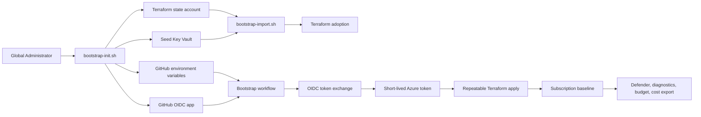
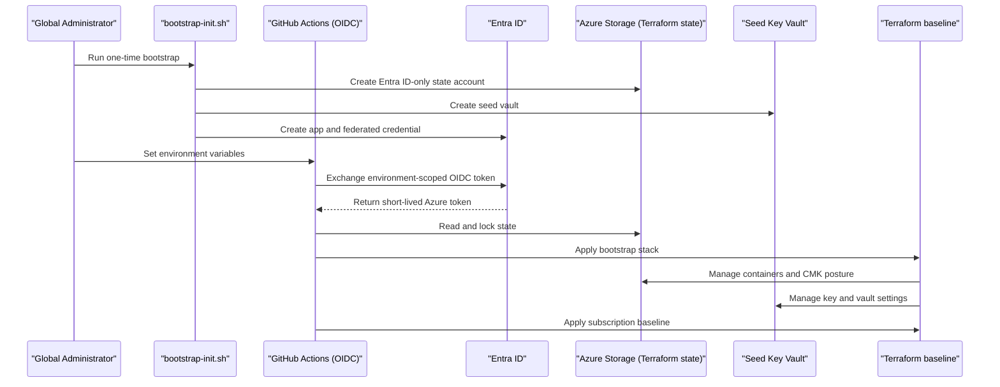

# Azure foundation

Azure foundation is the trust and control-plane base for the platform. It creates the first safe path from a brownfield or empty Azure subscription to repeatable Terraform delivery from GitHub Actions, without long-lived credentials in GitHub or the repository.

The capability also makes each subscription ready to participate in an existing Azure Landing Zone. It does not create management groups or tenant-wide policy. Those remain with the enterprise ALZ owner; this platform hardens subscriptions after they exist and are placed correctly.

## How it works

The flow begins with a narrow human action and then closes the automation loop:

1. An operator with Entra Global Administrator and either subscription Owner or Contributor plus User Access Administrator at the required bootstrap scopes runs `scripts/bootstrap/bootstrap-init.sh` or `make bootstrap-init` against the bootstrap subscription.
2. The script creates the state resource group, an Azure Storage account for Terraform state, the first state container, the seed Key Vault, and the bootstrap Entra application registration.
3. The same script creates a GitHub federated credential scoped to the repository and GitHub Environment, then prints GitHub Actions variables. It does not print or create client secrets.
4. The operator sets those values as GitHub Actions variables, not secrets.
5. `make bootstrap-tf-init` initializes the Terraform backend from local, gitignored backend configuration.
6. `make bootstrap-import` adopts the resources created by the script into Terraform state so Terraform reconciles them in place rather than replacing them.
7. The bootstrap workflow uses GitHub OIDC to exchange a short-lived GitHub token for an Azure access token.
8. During adoption, `bootstrap-init.sh` leaves the state account and seed Key Vault public-network reachable until the first apply; shared keys are disabled and Entra RBAC still protects data access, but operators should run the first apply promptly.
9. During the initial public-endpoint workflow phase, the runner temporarily allowlists its current IP on the state account and seed Key Vault, runs Terraform, and removes that IP after the run.
10. Terraform creates the customer-managed key, user-assigned identity, remaining state containers, firewall baseline, monitoring, and break-glass alert plumbing.
11. Later applies are drift detection and controlled changes through the same OIDC path.
12. Existing subscriptions are then onboarded with the subscription baseline stack.
13. The baseline configures only subscription-scoped controls: Defender for Cloud pricing, Activity Log diagnostics when enabled with an existing workspace, an optional budget, and optional Cost Management export.
14. Discovery and policy exception workflows handle inherited policy, mandatory tags, and brownfield findings without weakening ALZ-owned assignments.

This guide continues into [Connectivity & egress](./connectivity-egress.md), where private networking replaces the temporary runner allowlist. Platform runtime services then build on that network in [Platform shared services](./platform-services.md).

## Key components

| Component | How it works |
| --- | --- |
| `scripts/bootstrap/bootstrap-init.sh` | One-time, idempotent Azure CLI script run by a Global Administrator. It creates the state resource group, state storage account, `bootstrap` container, seed Key Vault, OIDC app, federated credential, and least-privilege role assignments. |
| `scripts/bootstrap/bootstrap-import.sh` | Imports the script-created resources into Terraform state so the first Terraform apply adopts and reconciles them in place. |
| `make bootstrap-init` | Wrapper for the one-time script. Flags are passed with `ARGS`. |
| `make bootstrap-tf-init` | Initializes the `_bootstrap` Terraform backend from `backend.hcl`, which is local and gitignored. |
| `make bootstrap-import` | Runs the import helper after backend initialization. |
| `make bootstrap-plan` and `make bootstrap-apply` | Local break-glass equivalents of the bootstrap workflow for the `_bootstrap` stack. |
| Terraform state account | AzureRM backend storage with blob lease locking, versioning, soft delete, RA-GRS, shared-key access disabled, and customer-managed key encryption after the first apply associates the key. |
| State containers | Containers separate state by capability and environment profile, limiting blast radius and enabling least-privilege access. |
| Seed Key Vault | Holds bootstrap-time keys and bootstrap secrets, uses RBAC and purge protection, and later moves behind Private Endpoint access. |
| GitHub OIDC app | Entra application that trusts GitHub Actions tokens for the repository and GitHub Environment subject. |
| Bootstrap deploy identity | Has no Microsoft Graph permissions. Azure roles are scoped to the state resource group, state account, and seed vault data plane. |
| Break-glass accounts | Two cloud-only Entra accounts with sealed credentials, PIM-eligible Global Administrator access, Conditional Access exclusions, and sign-in alerting. |
| Subscription baseline stack | Hardens one existing subscription at a time without moving it or creating tenant-wide policy assignments; diagnostics, budgets, and cost export are enabled only when the required inputs are supplied. |
| Readiness discovery | Read-only checks inventory inherited policy, Defender, diagnostics, resource providers, and mandatory tag gaps before applying the baseline. |
| Reference policy pack | Azure Policy JSON remains validated in CI for ALZ owners, while assignment ownership stays outside this repository. |

### Profiles

| Profile | Foundation behavior |
| --- | --- |
| `demo` | May use a single subscription for cost-conscious evaluation. The same secret-zero, OIDC, state, and tag expectations apply. |
| `nonprod` | Uses the same baseline controls as production, usually with lower budget thresholds and non-production shared-service destinations. |
| `prod` | Requires production-grade review, Defender tiers, diagnostic routing, cost controls, break-glass monitoring, and ALZ placement evidence before platform services depend on it. |

The profile does not change the core trust model. All profiles use Terraform state in Azure, GitHub OIDC, no long-lived GitHub secrets, and subscription-scoped hardening after ALZ placement.

## Decisions

| Decision | Governing ADR |
| --- | --- |
| Terraform state is Azure-native, locked by blob leases, encrypted, and separated by capability containers. | [ADR-0014: Terraform remote state model](../adr/0014-terraform-state.md) |
| GitHub Actions authenticates to Azure through environment-scoped OIDC, and the deploy identity has no Microsoft Graph permissions. | [ADR-0025: GitHub to Azure OIDC federation and a zero-Graph deploy identity](../adr/0025-oidc-federation.md) |
| Emergency recovery uses two cloud-only break-glass accounts with sealed credentials and alerting. | [ADR-0024: Break-glass procedure and activation alerting](../adr/0024-break-glass.md) |
| The subscription baseline uses native `azurerm` resources and defers AVM modules until a later resource-specific need exists. | [ADR-0026: AVM module pinning, upgrade cadence, and the subscription-baseline composition choice](../adr/0026-avm-modules.md) |
| The repository baselines subscriptions after an external ALZ owner creates and places them. | [ADR-0028: Subscription topology and ALZ ownership boundary](../adr/0028-subscription-topology.md) |
| Initial runner access is public endpoint plus just-in-time IP allowlisting, then private access after connectivity exists. | [ADR-0048: Runner connectivity model](../adr/0048-runner-connectivity.md) |
| The compliance baseline is inherited ALZ/CIS policy plus subscription-scoped hardening by this repository. | [ADR-0011: Compliance baseline](../adr/0011-compliance-baseline.md) |

## Operate it

| Runbook | Use it for |
| --- | --- |
| [Bootstrap and secret zero](../runbooks/bootstrap.md) | Creating the first state account, seed Key Vault, OIDC trust, imports, first apply, break-glass alert wiring, and the private-networking retrofit handoff. |
| [Existing subscription onboarding](../runbooks/subscription-onboarding.md) | Discovering inherited policy, confirming ALZ placement, applying Defender, diagnostics, budgets, and cost export, then draining tag and policy findings. |
| [Secret rotation](../runbooks/secret-rotation.md) | Rotating Key Vault-backed values consumed by workloads and platform controllers after the foundation is in place. |
| [Policy exception](../runbooks/policy-exception.md) | Requesting scoped, time-bound exemptions instead of weakening inherited policy. |

Operationally, treat the bootstrap path as a root-of-trust workflow:

1. Keep `backend.hcl`, `terraform.tfvars`, discovery snapshots, kubeconfigs, and tenant-specific values out of Git.
2. Confirm GitHub Environment protection before any OIDC-backed apply.
3. Run the first apply promptly after adoption so the network-open bootstrap window closes and default-deny firewall rules take over.
4. Re-run plans after adoption until the bootstrap stack is idempotent.
5. Verify break-glass sign-in logs reach the monitoring workspace before relying on the alert.
6. Use subscription readiness discovery before every brownfield onboarding.
7. Do not grant root management group permissions unless a future, documented tenant-scope capability explicitly requires them.
8. After [Connectivity & egress](./connectivity-egress.md) lands, complete the private endpoint retrofit and do not rely on private-only state or Key Vault access until a reviewed bootstrap change exists and has disabled public access.
