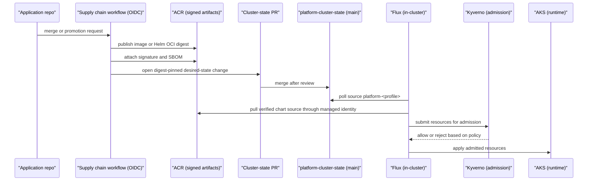
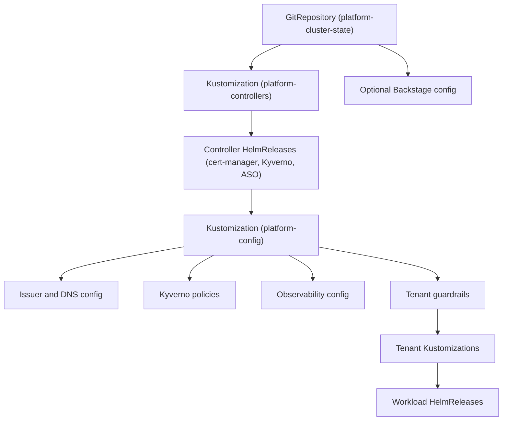
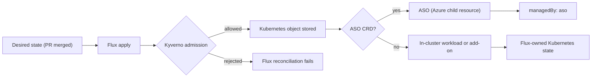

# GitOps platform

GitOps platform makes the private AKS cluster converge from reviewed source rather than from ad hoc cluster commands. Flux is installed as the in-cluster reconciler, but the desired state lives in a separate `platform-cluster-state` repository so platform code, CI workflows, and cluster runtime state have clear blast-radius boundaries.

The capability consumes platform shared services such as AKS, ACR, Key Vault, Postgres, Service Bus, DNS, managed identities, and private networking. It also closes the loop with [supply chain & CI/CD](./supply-chain-cicd.md), which publishes signed artifacts and opens reviewed desired-state updates, and with [platform shared services](./platform-services.md), which owns the Azure substrate Flux reconciles onto.

## How it works

```mermaid
flowchart LR
  A["Platform repo (source templates)"] --> B["Terraform (platform stack)"]
  B --> C["platform-cluster-state (separate repo)"]
  B --> D["AKS Flux extension (managed)"]
  D --> E["Flux source (platform-<profile>)"]
  E --> C
  C --> F["Environment overlay (clusters/overlays/<profile>)"]
  F --> G["Controllers (CRDs and Helm releases)"]
  G --> H["Add-on config (policies and resources)"]
  H --> I["Tenant paths (vended namespaces)"]
  I --> J["Workloads (Helm and Kustomize)"]
```

1. The platform repository contains the tested seed under `platform-gitops/`.
2. Terraform initially creates and seeds the separate `platform-cluster-state` repository, then protects it with CODEOWNERS and branch rules.
3. Terraform installs the Microsoft-managed AKS Flux extension on the private AKS cluster.
4. Terraform registers a platform Flux configuration named `platform-<profile>` for the target profile.
5. That name is the source-name contract used by vending and tenant Kustomizations. Standard clusters reference `platform-demo`, `platform-nonprod`, or `platform-prod` instead of a static source name.
6. The Flux configuration points at `clusters/overlays/<profile>` in `platform-cluster-state`.
7. The overlay imports the shared base plus environment-specific network and tenant paths.
8. Flux first reconciles controller resources such as namespaces, Helm repositories, Helm releases, CRDs, and service accounts.
9. Flux then reconciles add-on configuration such as issuers, policies, dashboards, and tenant guardrails.
10. Backstage uses a separate optional Flux configuration when the developer portal is enabled, so the root platform reconciliation does not depend on portal inputs.
11. After the initial seed, desired-state changes are made through reviewed PRs and GitHub App workflows, not ongoing Terraform writes.
12. Tenant manifests are added to the separate repo through vending and golden-path workflows rather than by direct cluster mutation.
13. Flux image automation is limited to the lowest-risk development path when enabled; non-production and production changes use reviewed, digest-pinned PR promotion from supply-chain workflows.
14. Flux runs continuously and prunes managed objects when they are removed from desired state.
15. Operators fix ordinary drift by changing source and letting Flux reconcile.

### Reconciliation order

1. The cluster-state GitRepository is the source of truth for the root path.
2. `platform-controllers` installs controllers and CRDs before CRD-backed resources are applied.
3. `platform-config` waits on controllers, then applies issuer, policy, observability, and tenant guardrail resources.
4. Tenant paths depend on the platform guardrails being present.
5. Workload Helm releases consume signed chart sources and vended service accounts.
6. The longer controller timeout gives Kyverno upgrade hooks enough room to complete after cold starts.
7. Backstage reconciliation is separate from the root platform path and is enabled only when developer portal inputs are available.

### Admission and ownership flow

1. Kyverno is the single Kubernetes admission engine.
2. Azure Policy remains for Azure control-plane governance, and OPA/Rego remains for Terraform plan-time checks.
3. Kyverno blocks unsigned images, mutable latest tags, missing required labels, missing resource requests and limits, privileged settings, and invalid tenant GitOps patterns in tenant and workload namespaces.
4. Platform controller namespaces can be excluded from image verification where upstream controller delivery requires it; those exceptions rely on pinned chart versions, reviewed GitOps changes, and managed identity controls instead of tenant workload policy.
5. Kyverno generates default network policy where required and validates that namespaces reach the expected default-deny posture.
6. Pod Security Admission provides baseline cluster posture; Kyverno enforces restricted namespace behavior.
7. ASO v2 is installed with a curated CRD allowlist for Service Bus, Key Vault, PostgreSQL, and Storage resource families.
8. Terraform owns shared platform resources such as AKS, ACR, Key Vault, Postgres server, Service Bus namespace, networking, and identities.
9. ASO owns only approved workload child resources and tags them with `managedBy: aso`.
10. Tenant users do not receive broad ASO write access by default; tenant paths are constrained by vending and policy.
11. Secrets are sourced from Key Vault through Secrets Store CSI by default, with External Secrets Operator used only when a Kubernetes Secret object is required.

## Key components

| Component | How it works | Source of truth |
| --- | --- | --- |
| `platform-gitops/` | Seed template in this repository for the separate cluster-state repo. | Platform repo |
| `platform-cluster-state` | Separate Flux-watched repo that holds cluster desired state. | Cluster-state repo |
| `clusters/_base/` | Shared platform add-ons and Flux system resources. | Cluster-state repo |
| `clusters/overlays/<profile>` | Profile-specific root path imported by the Flux configuration. | Cluster-state repo |
| `tenants/` | Target path for vended namespace and workload manifests. | Cluster-state repo |
| AKS Flux extension | Microsoft-managed installation of Flux controllers. | Terraform |
| `platform-<profile>` source-name contract | Flux configuration and source name expected by vending outputs and tenant Kustomizations. | Terraform contract |
| `platform-controllers` | Kustomization that installs controller namespaces, repositories, Helm releases, and CRDs. | Flux |
| `platform-config` | Kustomization that applies CRD-backed configuration after controllers are ready. | Flux |
| Flux image automation | Optional lowest-risk development path for automatic image updates; higher environments use reviewed, digest-pinned promotion PRs. | Flux and supply-chain workflows |
| Workload Identity | Gives Flux, cert-manager, external-dns, ESO, and ASO short-lived Azure access. | Terraform and Flux |
| cert-manager | Issues public DNS-01 certificates and private CA certificates backed by Key Vault material. | Flux |
| external-dns | Publishes public and private DNS records from ingress resources. | Flux |
| Secrets Store CSI | Mounts Key Vault secrets and certificates without storing durable secret state in Git. | Flux and Key Vault |
| External Secrets Operator | Syncs selected Key Vault values into Kubernetes Secrets when required by a controller or app. | Flux and Key Vault |
| Kyverno | Enforces and mutates Kubernetes resources as the single admission engine. | Flux and policy files |
| ASO v2 | Reconciles curated Azure child resources from Kubernetes CRDs. | Flux for operator, ASO for child resources |
| KEDA | Enables event-driven scaling patterns used by golden paths. | Flux |
| OpenTelemetry and Azure Monitor add-ons | Forward metrics, logs, and traces into managed observability services. | Flux |

### Profiles

| Profile | GitOps posture |
| --- | --- |
| `demo` | Uses the same source-name contract and layout, with cost-conscious overlays and demo-specific public ingress exceptions where documented. |
| `nonprod` | Exercises signed-artifact enforcement, tenant guardrails, and promotion flow before production. |
| `prod` | Uses stricter operating windows, production-grade add-on sizing, and reviewed cluster-state changes. |

The profile changes the overlay path and selected patches, not the control model. Flux remains the in-cluster source of truth, the separate cluster-state repo remains the desired-state boundary, and Terraform remains the owner of the Azure substrate.

## Decisions

| Decision | What it means for this capability |
| --- | --- |
| [ADR-0036: Kyverno is the single in-cluster policy engine](../adr/0036-kyverno-single-engine.md) | Kyverno owns Kubernetes admission and mutation; the AKS Policy Gatekeeper add-on is not used. |
| [ADR-0006: Default to Secrets Store CSI with ESO as an exception path](../adr/0006-secrets-in-cluster.md) | Key Vault remains the durable secret source, CSI is default, and ESO is allowed only when Kubernetes Secret objects are required. |
| [ADR-0005: Use ASO v2 with a curated ownership boundary](../adr/0005-aso-boundary.md) | ASO is installed with a limited CRD set and owns only approved child resources tagged `managedBy: aso`. |
| [ADR-0054: Flux controller Workload Identity migration](../adr/0054-flux-controller-workload-identity-migration.md) | Flux source access uses controller-level Workload Identity and avoids object-level source identity settings. |
| [ADR-0055: Public Backstage ingress for demo](../adr/0055-public-backstage-ingress.md) | Demo-only public developer portal ingress is an explicit exception reconciled separately from the default private platform path. |
| [ADR-0051: Cross-repository GitHub writes](../adr/0051-cross-repo-github-writes.md) | Ongoing cluster-state updates use reviewed PRs and GitHub App identity rather than Terraform or personal tokens. |

These decisions keep GitOps authoritative without turning the cluster into an unrestricted Azure control plane. They also keep secrets out of Git, avoid duplicate admission engines, and ensure artifact verification lines up with the supply-chain workflows that publish images and charts.

## Operate it

| Runbook | Use it when |
| --- | --- |
| [Flux extension recovery](../runbooks/flux-extension-recovery.md) | Recovering a managed Flux extension that cannot converge because stale extension settings conflict with the desired controller-level Workload Identity configuration. |
| [Certificate management](../runbooks/cert-management.md) | Choosing public DNS-01 or private CA certificate paths and troubleshooting issuer readiness. |

For ordinary drift, do not mutate cluster objects by hand. Change `platform-cluster-state`, let Flux reconcile, and inspect the failing Kustomization or HelmRelease if convergence stops. Use break-glass cluster commands only for incidents, then backfill source immediately so the next reconciliation does not undo or obscure the recovery.

Operational checks should confirm that the `platform-<profile>` source exists, `platform-controllers` and `platform-config` are ready, Kyverno admission webhooks are the only policy admission path, ASO CRDs match the curated allowlist, tenant Helm sources point to the platform ACR Helm namespace, and secret consumers have a documented rotation contract.
