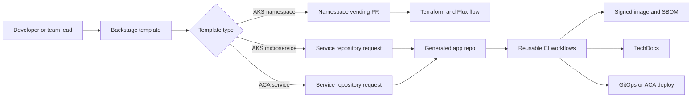
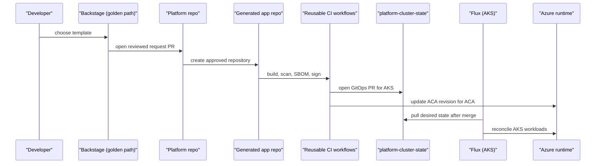
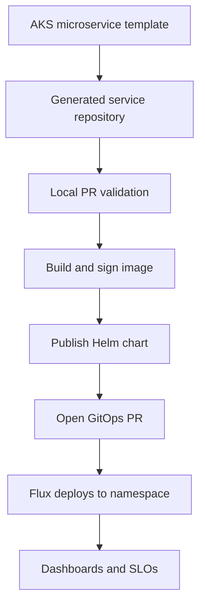
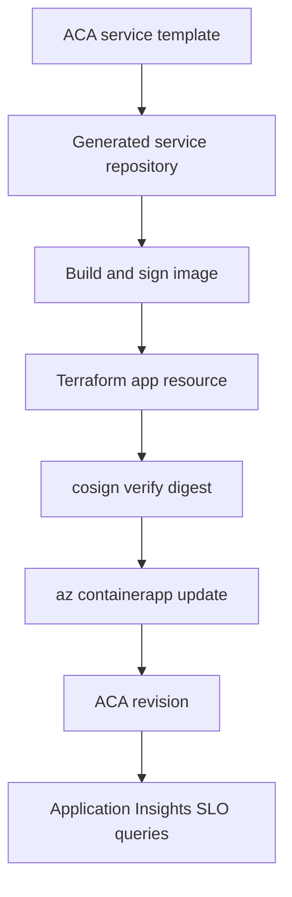
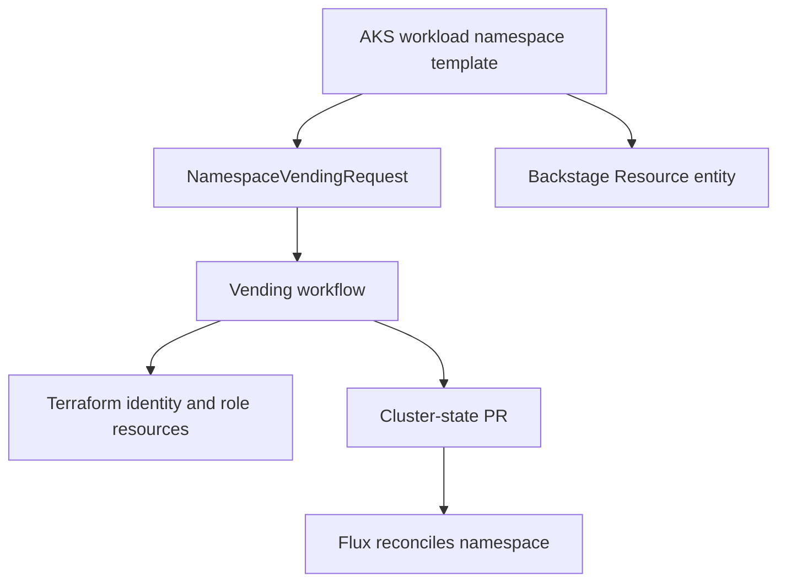

# Golden paths

Golden paths are the productized developer entry points for the platform. They package platform decisions into Backstage templates so teams can create services and namespaces with CI, SBOMs, signing, GitOps, dashboards, SLOs, cost tags, TechDocs, and ownership metadata by default.

The templates do not replace supply-chain workflows, vending workflows, or cluster state. They call those capabilities with safe defaults and reviewed outputs.

## How it works

1. A user selects a Backstage Software Template.
2. Backstage checks template permissions through platform RBAC.
3. The template collects ownership, product, cost, data classification, environment, and runtime inputs.
4. The template renders a skeleton or request YAML.
5. Backstage opens a PR in the platform repository.
6. Platform and security reviewers inspect the generated request.
7. For namespace requests, merge triggers GitHub Actions and Terraform to create tenancy and open the cluster-state PR.
8. For service requests, platform reviewers create the target repository from the reviewed skeleton under `golden-path-requests/...`.
9. Generated service repositories use [supply chain & CI/CD](./supply-chain-cicd.md) workflows to build, scan, sign, publish SBOMs, publish TechDocs, and deploy through the approved path.
10. AKS services use GitOps PRs and Flux reconciliation.
11. ACA services use the documented CI-push exception after signature verification.
12. Ownership, on-call metadata, SLOs, dashboards, and cost tags are present from the first commit.

## Key components

| Template | When to use it | Primary output |
| --- | --- | --- |
| `aks-workload-namespace` | A team needs an AKS namespace before deploying workloads. | `NamespaceVendingRequest` plus Backstage `Resource` metadata. |
| `aks-microservice` | A service needs Kubernetes features such as Helm packaging, namespace isolation, ServiceMonitor, HPA, PDB, or KEDA support. | A team-owned service repository and GitOps workload PR path. |
| `aca-service` | A simpler container workload fits Azure Container Apps and does not need Kubernetes control-plane features. | A team-owned ACA service repository with Terraform-owned app resource and signed digest deployment. |

### Common defaults

| Default | How it appears |
| --- | --- |
| CI | Generated `.github/workflows/ci.yml` calls reusable platform workflows. |
| SBOM | Container builds generate SPDX and CycloneDX SBOMs. |
| Signing | Images and Helm charts are signed with cosign keyless where applicable. |
| GitOps | AKS workloads push Flux manifests to cluster state; namespace vending writes tenant manifests. |
| Dashboards | Templates include telemetry conventions and observability artifacts. |
| SLOs | AKS uses `slo.yaml`; ACA includes Application Insights KQL SLO queries. |
| Cost tags | Generated resources include owner, product, cost center, environment, data classification, and repo metadata. |
| TechDocs | Repositories include `mkdocs.yml`, docs pages, and TechDocs publishing. |
| Ownership | `catalog-info.yaml`, CODEOWNERS, on-call annotations, and `spec.owner` are generated. |
| Dependency updates | Generated repos include Renovate configuration. |
| Inner loop | Generated repos include devcontainer support. |

### Template 1: AKS microservice

The AKS microservice template is for services that need the Kubernetes substrate. Namespace-level NetworkPolicy stays owned by vending and egress exception flows.

It scaffolds:

| Area | Output |
| --- | --- |
| Runtime | Node.js TypeScript, Python, or .NET sample service. |
| Container | Dockerfile and PR-time local container build. |
| Developer environment | `.devcontainer/`, tool versions, README, and language-specific files. |
| Kubernetes package | Helm chart with deployment, service, ingress option, HPA, PDB, ServiceMonitor, KEDA scaled object support, and helper labels. |
| GitOps | `gitops/dev` manifests with image and chart digest placeholders. |
| Supply chain | CI calls build/sign/SBOM, Helm publish, TechDocs publish, and GitOps PR workflows. |
| Observability | OTel conventions, `slo.yaml`, runbook annotations, ServiceMonitor, and labels. |
| Ownership | Backstage Component, CODEOWNERS, `spec.owner`, team/product/cost metadata, and on-call annotations. |

The first push to `main` builds and signs the image, publishes the chart, publishes TechDocs, and opens a GitOps PR into the team's namespace workload path. Flux deploys after merge.

### Template 2: ACA service

The ACA service template is for lightweight HTTP, queue, cron, or event-driven workloads that do not need Kubernetes primitives. It targets the platform-managed ACA environment instead of creating one per app.

It scaffolds:

| Area | Output |
| --- | --- |
| Runtime | Node.js TypeScript, Python, or .NET sample service. |
| Infrastructure | Terraform for `azurerm_container_app`, variables, outputs, and environment tfvars. |
| Deployment | Build/sign/SBOM workflow, Terraform validate/plan/apply, cosign verification, and `az containerapp update --image <digest>`. |
| Scaling | Input for HTTP, queue, or cron scale rule; queue scaling uses platform protected variables. |
| Observability | Application Insights wiring and KQL packs for availability, failure ratio, and latency. |
| Documentation | TechDocs scaffold and publishing workflow. |
| Ownership | Backstage Component, CODEOWNERS, cost tags, product/team metadata, and on-call annotations. |

ACA apps are outside the AKS Flux boundary. Terraform owns resource shape, identity, tags, scaling, and ingress. CI owns app revision rollout after signature verification. Terraform ignores subsequent image drift so revision updates do not become noisy infrastructure changes. Kyverno admission does not apply to ACA.

### Template 3: AKS workload namespace

The AKS workload namespace template prepares an AKS landing space before microservices are deployed. It collects team, product, environment, namespace, region, quota tier, cost center, on-call rotation, data classification, confidentiality, Entra group object ID, platform AKS ID, ACR ID, resource group, and service account.

It scaffolds:

| Area | Output |
| --- | --- |
| Request as code | `NamespaceVendingRequest` under `vending/requests/namespaces/`. |
| Catalog | Backstage `Resource` entity for ownership, cost, and on-call tracking. |
| Quota | Concrete ResourceQuota values selected from the quota tier. |
| Identity | Immutable Entra group object ID and service account binding inputs. |
| Review | Platform and security reviewer hints in the generated PR. |

This template relies on [tenancy vending & onboarding](./tenancy-vending-onboarding.md). It opens the same reviewed vending path used by platform operators.

## Key components by repository path

| Path | Role |
| --- | --- |
| `templates/aks-microservice/` | Backstage template and skeleton for AKS services. |
| `templates/aca-service/` | Backstage template and skeleton for ACA services. |
| `templates/aks-workload-namespace/` | Backstage template and skeleton for namespace vending requests. |
| `templates/_partials/` | Shared catalog, devcontainer, TechDocs, Renovate, on-call, Helm helper, SLO, rule group, and KEDA fragments. |
| `templates/*/skeleton/.github/workflows/ci.yml` | Generated CI entry points. |
| `templates/*/skeleton/catalog-info.yaml` | Backstage metadata and ownership. |
| `templates/*/skeleton/docs/` | Initial TechDocs pages. |
| `templates/aca-service/skeleton/infra/` | Terraform for the generated Container App. |
| `templates/aks-microservice/skeleton/chart/` | Helm package for AKS workloads. |
| `templates/aks-microservice/skeleton/gitops/` | Flux/Kustomize workload manifests. |

## Profiles

| Profile | Golden path behavior |
| --- | --- |
| `demo` | First-run speed and cost focus while preserving signed images, SBOMs, tags, ownership, and docs. |
| `nonprod` | Same workflow contracts and review process for integration. |
| `prod` | Stricter protected environments, production-grade services, and reviewed deployment gates. |

## Decisions

| Decision | Effect |
| --- | --- |
| [ADR-0044: Golden path template versioning](../adr/0044-template-versioning.md) | Templates declare a contract version and deprecation metadata. |
| [ADR-0050: ACA managed environment as a platform shared service](../adr/0050-aca-managed-environment.md) | ACA templates deploy apps into a platform-managed environment. |
| [ADR-0007: Use cosign keyless signing for container and chart artifacts](../adr/0007-image-signing.md) | Generated repositories use signed artifacts. |
| [ADR-0037: OTel resource attributes and log fields](../adr/0037-otel-conventions.md) | Templates share telemetry dimensions for dashboards, SLOs, traces, logs, and cost. |
| [ADR-0053: ACA apps use CI-push deploys with Terraform-owned resources](../adr/0053-aca-gitops-exception.md) | ACA delivery verifies signatures but updates revisions through CI. |

## Operate it

| Runbook | Use it for |
| --- | --- |
| [Golden paths v1 runbook](../runbooks/golden-paths.md) | Template prerequisites, support, failure handling, and validation. |
| [Release and image promotion](../runbooks/release.md) | Build evidence, signatures, promotion, and rollback. |
| [Environment and subscription vending](../runbooks/vending.md) | Namespace requests generated by the namespace template. |
| [Team onboarding](../runbooks/team-onboarding.md) | Team identity and Backstage RBAC before team-scoped templates. |

Operational rules:

1. Complete team onboarding before enabling team-scoped service templates.
2. Use the namespace template before AKS microservices when no namespace exists.
3. Keep generated repositories private unless approved otherwise.
4. Do not remove mandatory tags, owner metadata, SLO files, or TechDocs.
5. For AKS, deploy through GitOps PRs and Flux.
6. For ACA, verify the signed digest before `az containerapp update`.
7. Use the egress exception path for network exceptions.
8. Keep template changes versioned and documented.
