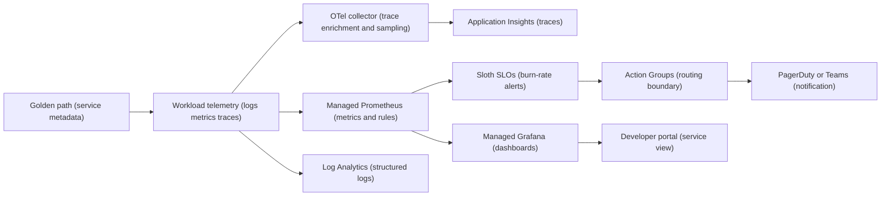
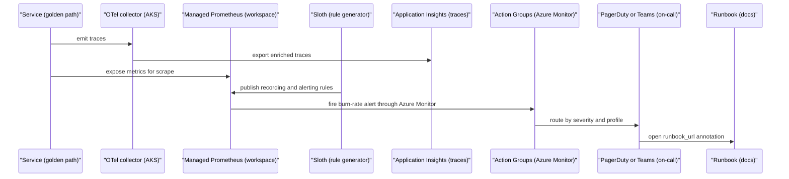
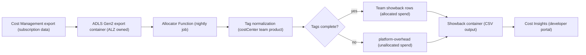

# Observability, SRE & FinOps

Observability, SRE & FinOps gives every platform and workload path a shared way to emit telemetry, define SLOs, route alerts, publish status, and allocate cloud cost. The capability works by turning golden-path metadata into consistent signals before services reach production-like environments.

## How it works

1. A platform service or workload is created from a [golden path](./golden-paths.md) or a platform template.
2. The template supplies the service name, namespace, team, product, environment, version, cost center, and runbook links.
3. Application code emits JSON structured logs and OpenTelemetry traces and metrics through the language library selected for that stack.
4. Kubernetes labels and Flux substitutions give the collector the environment and ownership context it needs.
5. The OTel collector enriches trace telemetry with the common resource attributes and applies the configured trace sampling policy.
6. Metrics are scraped and evaluated by Managed Prometheus, traces flow through the collector to Application Insights, and container logs flow to Log Analytics.
7. Sloth turns each service SLO definition into Prometheus recording rules and multi-window burn-rate alerts.
8. Managed Grafana reads the same metrics to show platform, service, SLO, and burn-rate dashboards.
9. Azure Monitor Action Groups route alerts to PagerDuty for production-like profiles or Teams for demo.
10. Backstage surfaces dashboards, SLOs, runbooks, and cost information beside the service catalog entry.

The operating model is deliberately narrow: default alerts are SLO burn-rate alerts, not every raw resource threshold. That keeps pages actionable and forces each alert to carry a runbook URL.

### Cost showback flow

1. Subscription cost exports land in the existing ADLS Gen2 container owned by the Azure foundation and subscription baseline boundary.
2. A nightly Azure Function reads new export blobs with its managed identity.
3. The function groups line items by `costCenter`, `team`, and `product` tags.
4. Rows with missing or malformed ownership tags are assigned to `platform-overhead` until the owning tags are corrected.
5. The function publishes `showback/YYYY/MM/DD/team-showback.csv` into the showback storage container.
6. Backstage Cost Insights reads the showback container through its workload identity and displays team-level cost trends.
7. The community Cost Insights UI reads platform showback data through the platform-owned showback adapter, keeping CSV translation local while avoiding a custom portal UI.

The allocator is disabled by default and is enabled per profile after the export container, function plan, identity, and Backstage configuration are ready. The secure deployment path keeps Function App SCM and FTP basic publishing disabled and publishes the package with AAD-authenticated OneDeploy.

Ownership is split deliberately: Azure foundation and subscription baseline provide or configure the source Cost Management export location, this capability owns the allocator Function and its RBAC, platform shared services provide the storage and identity primitives, and the developer portal only reads the published showback output.

## Key components

| Component | How it works |
| --- | --- |
| OpenTelemetry conventions | Standard attributes and JSON log fields make telemetry queryable by service, namespace, team, product, environment, and version. |
| OTel collector | Enriches trace telemetry, applies environment metadata, and controls trace volume through profile-specific sampling. |
| Managed Prometheus | Stores platform and workload metrics and evaluates Prometheus-compatible SLO and alert rules. |
| Managed Grafana | Provides dashboards-as-code for platform SLOs, workload SLOs, burn rate, Flux health, AKS API health, and Kyverno admission cost. |
| Log Analytics | Stores structured container logs and Azure control-plane diagnostic data. |
| Application Insights | Receives traces and application telemetry from OpenTelemetry instrumentation. |
| Sloth | Converts compact SLO definitions into recording rules and multi-window multi-burn-rate alerts. |
| Azure Monitor Action Groups | Keep alert routing Azure-native and separate receiver configuration from alert authoring. |
| PagerDuty | Receives SEV1 and SEV2 pages for nonprod and prod through the native Azure Monitor path. |
| Teams webhook | Provides the lower-cost demo route while still exercising Action Groups. |
| Upptime | Publishes the low-ops status page backed by GitHub Pages and repository state. |
| Cost allocator Function | Reads Cost Management exports, allocates spend by tags, and writes showback CSVs. |
| Backstage Cost Insights | Displays showback data in the service catalog and team views. |

### Telemetry contract

| Signal | Contract |
| --- | --- |
| Metrics | Prometheus-compatible metrics with ownership and environment labels. |
| Logs | JSON, ECS-aligned field names, trace correlation, team, product, and environment fields. |
| Traces | OpenTelemetry spans with `service.name`, `service.namespace`, `team`, `product`, `deployment.environment`, and `version`. |
| SLOs | Service-owned `slo.yaml` rendered into Sloth and Managed Prometheus rule groups. |
| Alerts | `severity` label plus `runbook_url` annotation; CI rejects missing runbook links. |
| Costs | Azure Cost Management exports allocated by `costCenter`, `team`, and `product`. |

### Platform SLO set

| SLO | Target | Measurement |
| --- | --- | --- |
| Backstage availability | >= 99.5% | Front Door synthetic check and ingress 5xx ratio. |
| Flux reconciliation p95 latency | < 5 minutes | `gotk_reconcile_duration_seconds` histogram. |
| Cluster API availability | >= 99.9% | AKS API server metrics and Azure Monitor health. |
| Golden-path success rate | >= 95% | Scaffolder success ratio and first-run CI green ratio over 30 days. |
| Vending PR to merge latency p95 | < 1 working day | GitHub Actions and pull request timestamps. |
| Postgres restore time | <= 60 minutes | Restore drill measurement. |
| Signature verification overhead | < 200 ms | Kyverno admission review duration. |

### FinOps automation

| Mechanism | Flow |
| --- | --- |
| Cost showback | Cost Management export -> allocator Function -> showback container -> Cost Insights. |
| AKS node auto-provisioning | Cluster capacity expands and contracts to fit workload demand. |
| KEDA scale-to-zero patterns | Golden paths reference ScaledObject patterns where event-driven scale-to-zero is safe. |
| VPA Recommender and Goldilocks | Weekly reports identify over-provisioned workloads and open improvement issues. |
| Demo TTL sweep | A scheduled workflow checks `expiresOn` and opens decommission PRs for expired demo environments. It runs nightly only when the `PLATFORM_ONLINE` repository variable is `true`; when the demo subscription is torn down it skips cleanly instead of failing health. Manual dispatch can still force a run for investigation. |

### Profiles

| Profile | Behavior |
| --- | --- |
| `demo` | Keeps 100 percent trace sampling for easier demonstrations, routes alerts to Teams, allows lower-cost service choices, and uses TTL cleanup. |
| `nonprod` | Uses production-like routing with PagerDuty where configured and lower trace volume than demo. |
| `prod` | Uses bounded trace volume with error-priority sampling, PagerDuty routing, HA backing services, and stricter operational review. |

Shared [platform shared services](./platform-services.md) provide the managed monitoring, storage, identity, and networking foundation that this capability consumes.

## Decisions

| Decision | Effect |
| --- | --- |
| [ADR-0037: OTel resource attributes and log fields](../adr/0037-otel-conventions.md) | Defines the telemetry dimensions used by dashboards, SLOs, alerting, Cost Insights, and catalog views. |
| [ADR-0038: Sloth is the SLO-as-code tool](../adr/0038-slo-tooling.md) | Uses Sloth to generate Prometheus recording rules and burn-rate alerts from compact service SLO definitions. |
| [ADR-0039: PagerDuty and Teams alert routing](../adr/0039-on-call-tooling.md) | Uses Azure Monitor Action Groups as the routing boundary, with PagerDuty for production-like profiles and Teams for demo. |
| [ADR-0040: Upptime is the MVP status page](../adr/0040-status-page-tooling.md) | Uses a GitHub-Pages-backed status page instead of operating another stateful status application. |
| [ADR-0057: Cost allocator Function publishes via AAD OneDeploy](../adr/0057-cost-allocator-aad-onedeploy.md) | Keeps basic publishing disabled and deploys the Function package with Entra-authenticated OneDeploy. |

## Operate it

| Runbook | Use it for |
| --- | --- |
| [Platform SLOs](../runbooks/platform-slos.md) | Monthly SLO review, alert requirements, and error-budget follow-up. |
| [Platform SLO burn](../runbooks/sre/platform-slo-burn.md) | Triage and mitigate fast error-budget consumption. |
| [Flux reconciliation latency](../runbooks/sre/flux-reconciliation-latency.md) | Restore GitOps health when reconciliation p95 exceeds target. |
| [Cluster API availability](../runbooks/sre/cluster-api-availability.md) | Respond to AKS API availability burn and control-plane faults. |
| [Cost showback failure](../runbooks/sre/cost-showback-failure.md) | Recover stale Cost Management export or allocator output. |

Operational rules:

1. Keep dashboards as code; do not rely on ad hoc Grafana exports as durable state.
2. Page on SLO burn by default; add raw resource alerts only when they have a clear runbook and owner.
3. Do not grant storage account keys to fix cost showback. Restore managed identity RBAC through Terraform.
4. Treat unallocated spend as a tagging defect and reconcile it during the monthly SLO and FinOps review.
5. Keep alert receiver identifiers, webhook URLs, and PagerDuty connector values in protected variables or secret stores.
