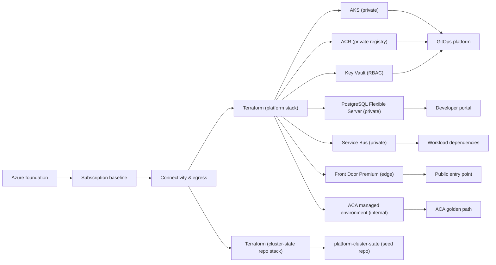
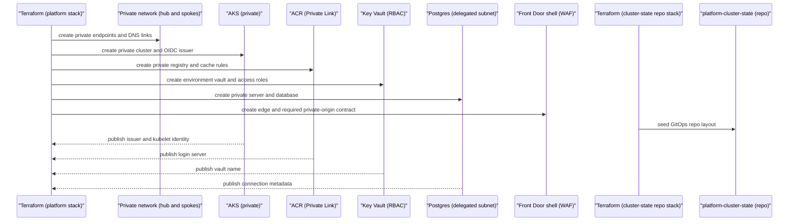
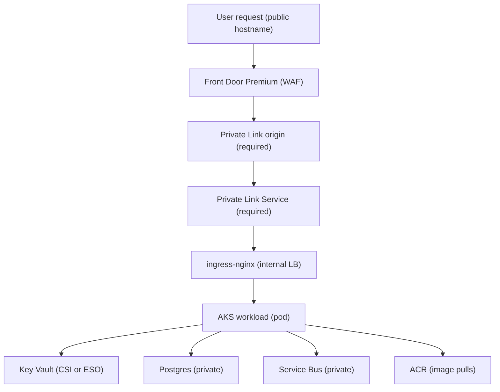

# Platform shared services

Platform shared services provide the secure Azure substrate that application teams and later platform capabilities use instead of building their own clusters, registries, databases, secret stores, event buses, and ingress paths. The capability is owned by Terraform, exposed through documented outputs, and consumed through GitOps, supply-chain workflows, Backstage, and curated workload automation.

It sits after Azure foundation, subscription baseline, and connectivity & egress are in place. Those earlier capabilities provide identity, policy inheritance, private DNS, routing, and controlled outbound paths; platform shared services then deploy the runtime and data services inside that governed network. For network assumptions and edge posture, see [connectivity & egress](./connectivity-egress.md). For in-cluster consumption, see [GitOps platform](./gitops.md).

## How it works

1. Azure foundation establishes repo conventions, bootstrap identity, state, and secret-zero practices.
2. Subscription baseline aligns the target subscription with inherited ALZ controls, diagnostics, Defender posture, tags, budgets, and policy expectations.
3. Connectivity & egress creates the hub, Private DNS, firewall or demo NAT path, private endpoint subnets, and default-deny outbound model.
4. The platform Terraform stack deploys one environment-shaped set of shared Azure services into the platform subscription.
5. AKS is created as a private cluster with Entra integration, Azure RBAC, local accounts disabled, OIDC issuer, Workload Identity, Azure CNI Overlay, and Cilium dataplane.
6. A system node pool carries critical add-ons; user workloads run on the default user pool and, where enabled, Microsoft-managed node auto-provisioning.
7. The AKS API server is private. Operators reach it through approved private paths such as Bastion, VPN, or ExpressRoute rather than public authorized IP ranges.
8. ACR stores platform and workload images, Helm OCI artifacts, signatures, SBOMs, and attestations behind Private Link.
9. ACR geo-replication provides a single registry login server with region-aware resiliency; failover does not require a second application-facing endpoint.
10. Artifact Cache handles supported unauthenticated sources such as Microsoft Container Registry and GitHub Container Registry. Unsupported sources such as quay.io use the import workflow.
11. Key Vault is provisioned per environment with RBAC, Private Link, purge protection, and soft delete. It remains separate from bootstrap Key Vault.
12. PostgreSQL Flexible Server is placed on private networking with PITR, CMK support, and a `backstage` database for the developer portal.
13. Service Bus provides the platform-internal event bus. Workload queues and topics are declared later through ASO rather than centrally pre-created.
14. ingress-nginx is seeded for GitOps and runs inside AKS as an internal load balancer after the controller is installed.
15. Front Door Premium with WAF is the edge component for public properties.
16. The required hardened edge pattern connects Front Door to ingress-nginx through a Private Link Service origin; if an environment only has the edge shell, ingress is not complete until that private-origin path is wired and region-validated.
17. WAF starts in detection and log mode for safe rollout; prevention mode is a required hardening decision before production public ingress relies on it for blocking.
18. The ACA managed environment is created as an internal, VNet-injected substrate for the ACA golden path; no application is deployed by this capability.
19. The separate cluster-state repo Terraform composition prepares `platform-cluster-state` with shared bases, environment overlays, tenant folders, branch protections, and CODEOWNERS.
20. Terraform publishes outputs needed by GitOps platform, including the AKS OIDC issuer, ACR login server, Key Vault name, DNS values, and managed identity client IDs.
21. Later capabilities consume those outputs through Flux post-build substitutions, Backstage configuration, and workload vending workflows.
22. Disaster recovery is designed into the service choices: Postgres PITR and geo-backup, ACR geo-replication, Key Vault recovery controls, AKS control-plane redeploy from IaC, Flux state replay, and AKS Backup as the intended resource and persistent-volume backup control where enabled.

### Target hardened request and runtime flow

This is the required hardened routing path for public platform properties. WAF starts in detection mode for rollout, so production blocking requires an explicit prevention-mode hardening decision. Until the Private Link Service origin is implemented in an environment, treat the edge as incomplete and allow only documented profile-scoped exceptions to expose public ingress.

1. Public traffic terminates at Front Door Premium and WAF.
2. The target hardened path has Front Door reach the cluster through a Private Link origin, not a public Kubernetes service.
3. ingress-nginx routes to Kubernetes services inside the private cluster.
4. Pods pull images from ACR through private connectivity.
5. Pods consume secrets and certificates through Key Vault-backed mechanisms installed by GitOps platform.
6. Platform and workload data paths remain private for Postgres, Service Bus, and Key Vault.
7. Egress follows the connectivity & egress allowlist rather than direct internet paths.

## Key components

| Component | How it works | Primary owner |
| --- | --- | --- |
| AKS private cluster | Runs platform add-ons and AKS workloads with private API access, Entra Azure RBAC, Workload Identity, Azure CNI Overlay, and Cilium dataplane. | Terraform |
| System node pool | Hosts critical cluster add-ons and is tainted for critical workloads. | Terraform |
| Default user pool | Provides initial workload capacity; non-demo profiles can add managed elastic capacity. | Terraform |
| ACR | Stores images, charts, SBOMs, signatures, and attestations; Private Link protects data-plane access. | Terraform and supply-chain workflows |
| Artifact Cache | Pulls supported upstream base images through ACR to reduce uncontrolled internet egress. | Terraform |
| Key Vault | Stores environment secrets, certificates, and CMK material with RBAC, Private Link, soft delete, and purge protection. | Terraform |
| PostgreSQL Flexible Server | Provides managed private PostgreSQL, PITR, CMK support, and the `backstage` database. | Terraform |
| Service Bus namespace | Provides durable platform-internal eventing; workload topics and subscriptions are child resources created through ASO. | Terraform for namespace, ASO for child resources |
| ingress-nginx | Provides the in-cluster ingress controller behind an internal load balancer. | GitOps platform after the substrate exists |
| Private Link Service | Required hardening that binds ingress-nginx to Front Door as a private origin after the ingress substrate is enabled and region support is confirmed. | Terraform |
| Front Door Premium and WAF | Provides public edge routing, TLS entry, detection-mode WAF rollout, and the required private-origin integration contract. | Terraform |
| ACA managed environment | Provides the internal shared substrate used by the ACA golden path. | Terraform |
| `platform-cluster-state` seed | Creates the separate Flux-watched desired-state repository skeleton. | Terraform and GitHub provider |
| DR controls | Combine geo-replication, backups, PITR, soft delete, IaC redeploy, and documented recovery objectives. | Platform operations |

### Profiles

| Profile | Platform services posture |
| --- | --- |
| `demo` | Cost-conscious defaults, reduced redundancy where documented, and simplified networking choices when the connectivity capability allows them. |
| `nonprod` | Private networking, policy enforcement, representative topology, and promotion testing before production. |
| `prod` | Zone-aware service choices where available, Postgres HA and geo-backup, hardened ingress, and stricter operating windows. |

Profile differences should not change ownership boundaries. Terraform still owns the shared Azure substrate, Flux owns in-cluster desired state, and ASO owns only approved workload child resources.

The hardened public application path is Front Door Premium with a private origin. The `demo` profile can carry explicitly documented public ingress exceptions for developer portal access when cost and simplicity outweigh the private-origin pattern; those exceptions must remain profile-scoped and reviewed.

## Decisions

| Decision | What it means for this capability |
| --- | --- |
| [ADR-0050: ACA managed environment as a platform shared service](../adr/0050-aca-managed-environment.md) | The platform creates the internal ACA environment, while ACA applications are created by the golden path later. |
| [ADR-0032: Platform-internal eventing uses Azure Service Bus](../adr/0032-platform-eventing.md) | Service Bus is the durable platform eventing default; workload messaging remains workload-owned through ASO. |
| [ADR-0052: Prefer Entra passwordless auth for Backstage Postgres](../adr/0052-backstage-postgres-auth.md) | The Postgres service is prepared for Backstage to move from rotatable password fallback to Entra-based runtime auth. |
| [ADR-0049: DDoS protection posture](../adr/0049-ddos-protection.md) | The MVP relies on Azure platform DDoS Basic by default and revisits Network Protection only when production triggers justify it. |
| [ADR-0055: Public Backstage ingress for demo](../adr/0055-public-backstage-ingress.md) | Demo-only public developer portal ingress is an explicit exception, not the default platform ingress pattern. |

Other linked platform decisions include the Azure-native Terraform ownership model, the Cilium dataplane choice, ingress-nginx with Front Door Premium, and active-passive recovery posture. Those choices keep shared services private, auditable, and reusable without pushing platform substrate creation into application templates.

## Operate it

| Runbook | Use it when |
| --- | --- |
| [AKS baseline operations](../runbooks/aks-baseline.md) | Checking private API access, identity, RBAC, Cilium networking, node pools, maintenance, and image hygiene. |
| [Certificate management](../runbooks/cert-management.md) | Choosing between public DNS-01 certificates and the Key Vault-backed private CA path. |
| [Region support matrix](../runbooks/region-matrix.md) | Validating availability zones, Cilium support, Front Door Private Link origin support, ACA features, and ACR cache support before rollout. |

Operationally, treat Terraform as the only writer for shared Azure resources. Use GitOps platform for in-cluster add-ons, supply-chain workflows for images and charts, and ASO only for the curated workload child resources. If an incident requires portal or CLI mutation, capture the reason, backfill the desired state, and close the loop through the owning capability.
