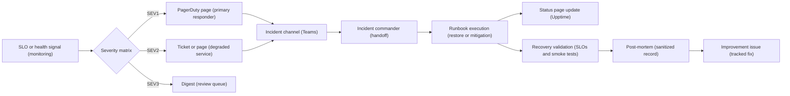
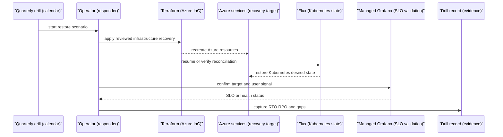

# Reliability operations

Reliability operations proves that the platform can recover, communicate, and improve when something fails. It turns the DR design, platform SLOs, alerting, runbooks, status page, break-glass controls, restore drills, incident workflow, and post-mortems into a recurring operating loop.

## How it works

1. [Observability, SRE & FinOps](./observability-sre-finops.md) produces alerts with severity labels and runbook URLs.
2. The responder classifies the event with the severity matrix and starts the incident workflow for SEV1 or SEV2.
3. PagerDuty opens the page for production-like profiles; Teams receives the configured notification path where enabled.
4. The responder creates or links the incident channel from the incident template, and the incident commander owns coordination, handoffs, status updates, and the decision to invoke restore procedures.
5. Operators execute the relevant runbook from the platform runbook catalog.
6. User-visible degradation is reflected on the Upptime status page.
7. Recovery is validated against the original SLO, Azure health signal, smoke test, or restore checklist.
8. SEV1 incidents produce a sanitized post-mortem and a restricted raw timeline or evidence bundle according to local retention policy.
9. Follow-up work is reviewed during the SLO and post-mortem review cadences.

The same operating loop is used for planned drills and live incidents. Drills keep the team familiar with the mechanics before a real outage forces their use.

The restore mechanisms and game-day practices below are runbook-derived operating targets. They are documented here as recovery procedures and validation evidence; only architectural decisions with accepted ADRs are linked in the Decisions section.

## Key components

| Component | How it works |
| --- | --- |
| DR matrix | Defines component tier, RTO, RPO, recovery mechanism, and validation method. |
| Platform SLOs | Provide measurable health targets and error-budget signals for platform paths. |
| Alert runbooks | Give responders the first triage, mitigation, and recovery steps for each active alert. |
| PagerDuty | Pages and escalates production-like incidents through the native Azure Monitor route. |
| Microsoft Teams | Hosts the incident channel and handoff thread. |
| Upptime | Publishes service status and incident updates with low operational overhead. |
| Terraform | Recreates Azure infrastructure and cluster control-plane-adjacent resources from code. |
| Flux | Reconciles Kubernetes desired state after cluster or namespace recovery. |
| Azure Backup for AKS | Restores Kubernetes resources and persistent volumes into an existing cluster where the follow-up backup path is enabled. |
| PostgreSQL PITR and geo-restore | Restores the Backstage and platform database to a tested point. |
| Key Vault soft-delete and paired vault restore | Recovers deleted secrets through soft-delete and uses paired-vault restore only where backup and repointing have been implemented. |
| ACR Premium geo-replication | Keeps one login server with regional replicas and validates pulls after primary replica disablement. |
| Terraform state account | Uses versioning and geo-redundancy to recover IaC state. |
| Break-glass accounts | Provide a monitored manual recovery path if federation, PIM, Conditional Access, or Entra access blocks normal operation. |
| Post-mortem template | Separates sanitized in-repo learning from restricted raw logs and timelines. |

### RTO and RPO matrix

| Tier | Component | RTO | RPO | Recovery mechanism | Validation |
| --- | --- | --- | --- | --- | --- |
| Critical | Postgres for Backstage and platform data | 1 hour | 5 minutes | PITR, with geo-redundant backup for prod | PITR restore drill. |
| Critical | ACR | 1 hour | 0 | Premium geo-replication to paired region | Registry failover or import drill. |
| Critical | Key Vault | 1 hour | 24 hours | Soft-delete, purge protection, private access, paired-vault restore where implemented | Vault recovery drill. |
| Important | AKS cluster | 4 hours | 24 hours | Terraform redeploy; AKS Backup for Kubernetes resources and PVs where enabled | Cluster redeploy and backup restore drill. |
| Important | Terraform state | 1 hour | 1 hour | RA-GRS storage and blob versioning | State restore exercise. |
| Standard | Workload PVCs | 8 hours | 24 hours | AKS Backup according to storage driver support | Per-driver restore drill. |

The matrix is a target, not proof. A target counts only after a restore drill records evidence that the team can meet it.

### Restore drills

| Drill | Flow | Success signal |
| --- | --- | --- |
| Postgres PITR | Restore the Backstage database to a recent point, validate catalog integrity, then cut over only after verification. | Backstage `/healthz`, catalog reads, and TechDocs reads succeed within the RTO. |
| AKS Backup | Where enabled, restore a sample team's Kubernetes resources and PVs into a fresh namespace on an existing cluster. | Workload resources, data, and namespace boundaries are present and healthy. |
| Key Vault recovery | Recover from soft-delete, or restore to a paired vault where that backup path is implemented, then repoint workloads and validate Workload Identity continuity. | Secrets or keys are available through the intended private path and consumers authenticate. |
| ACR failover | Disable the primary replica and verify pulls route to the surviving replica through the same login server. | Private DNS and image pulls succeed from the platform cluster. |
| Terraform state recovery | Restore versioned state from the replicated account and run a safe validation. | Terraform can read the expected state without rewriting unrelated resources. |
| Cluster redeploy | Recreate a demo cluster from IaC and let Flux reapply platform and workload desired state. | Cluster is operational, controllers reconcile, and platform smoke tests pass. |

AKS Backup does not restore the AKS control plane. The control plane and platform infrastructure are recreated from Terraform; Kubernetes resources and PVs are restored into a cluster only where that backup path is enabled.

### Incident workflow

| Step | Owner | Expected outcome |
| --- | --- | --- |
| Detect | Monitoring and on-call | Alert includes severity, dashboard, and runbook URL. |
| Declare | First responder | Severity is assigned and an incident channel is opened when required. |
| Command | Incident commander | Roles, timeline, next update time, and handoff owner are clear. |
| Mitigate | Service or platform operator | Risky rollouts are paused, source-of-truth changes are used, and blast radius is reduced. |
| Communicate | Incident commander or communications lead | Status page and stakeholder updates match user impact. |
| Recover | Operator | SLO, smoke, restore, or Azure health evidence confirms recovery. |
| Learn | Incident commander and owners | Post-mortem and follow-up issues are created within the expected cadence. |

SEV1 expectations are strict: page quickly, create or link the incident channel, assign an incident commander, and publish a status-page entry when users are affected.

### Game-days and scorecard

| Practice | How it works |
| --- | --- |
| Pod-level experiments | Kill a Backstage pod, disrupt cert-manager, or remove a workload NetworkPolicy in controlled environments and compare expected versus actual behavior. |
| Infrastructure-level experiments | Use Azure Chaos Studio for node, AKS API throttling, or firewall-rule scenarios where the blast radius is understood. |
| Platform health scorecard | Managed Grafana and automated review comments report weekly status against platform SLOs. |
| Review cadence | Weekly SLO or burn-rate health check and monthly post-mortem review remain separate forums. |

Chaos starts in demo, moves to nonprod after confidence improves, and does not run in prod without an explicit decision and approval path.

### Profiles

| Profile | Behavior |
| --- | --- |
| `demo` | Safe place for first drills, public portal demos, TTL cleanup, and low-risk chaos exercises. |
| `nonprod` | Primary proving ground for restore drills, incident workflow exercises, and production-like paging paths. |
| `prod` | Uses the tested runbooks, private access posture, stricter approvals, and production restore targets. |

The [platform shared services](./platform-services.md) capability provides the managed Postgres, ACR, Key Vault, AKS, state storage, monitoring, and private networking dependencies that reliability operations tests and recovers.

## Decisions

| Decision | Effect |
| --- | --- |
| [ADR-0024: Break-glass procedure and activation alerting](../adr/0024-break-glass.md) | Provides two monitored cloud-only recovery accounts with sealed credentials and mandatory post-use rotation. |
| [ADR-0039: PagerDuty and Teams alert routing](../adr/0039-on-call-tooling.md) | Keeps alert routing through Azure Monitor Action Groups and production-like paging through PagerDuty. |
| [ADR-0040: Upptime is the MVP status page](../adr/0040-status-page-tooling.md) | Uses a low-ops GitHub-Pages-backed status page for incidents and planned maintenance. |

## Operate it

| Runbook | Use it for |
| --- | --- |
| [DR matrix](../runbooks/dr-matrix.md) | RTO/RPO targets, recovery mechanisms, and validation expectations. |
| [Platform SLOs](../runbooks/platform-slos.md) | SLO definitions, monthly review, alert requirements, and error-budget follow-up. |
| [Backstage operations](../runbooks/backstage-ops.md) | Backstage upgrade, runtime secret, Postgres restore, TechDocs, Kubernetes plugin, and catalog-reconciliation recovery. |
| [Platform SLO burn](../runbooks/sre/platform-slo-burn.md) | Triage SLO burn, start incidents, pause risky rollouts, and confirm recovery. |
| [Cluster API availability](../runbooks/sre/cluster-api-availability.md) | Respond to AKS API availability burn, Azure health issues, and private connectivity faults. |
| [Flux reconciliation latency](../runbooks/sre/flux-reconciliation-latency.md) | Restore GitOps convergence when Flux latency exceeds target. |
| [Cost showback failure](../runbooks/sre/cost-showback-failure.md) | Keep showback data fresh when allocator or export paths fail. |

Operational rules:

1. Treat restore drills as production readiness evidence, not optional exercises.
2. Use source-of-truth systems during recovery: Terraform for Azure resources and Flux for Kubernetes state.
3. Do not broaden firewall, identity, or storage permissions as a shortcut without recording the incident rationale and reverting after recovery.
4. Activate break-glass only when normal identity paths cannot restore service; every activation is a security event.
5. Publish sanitized learning, keep raw evidence restricted, and track follow-up fixes to closure.
