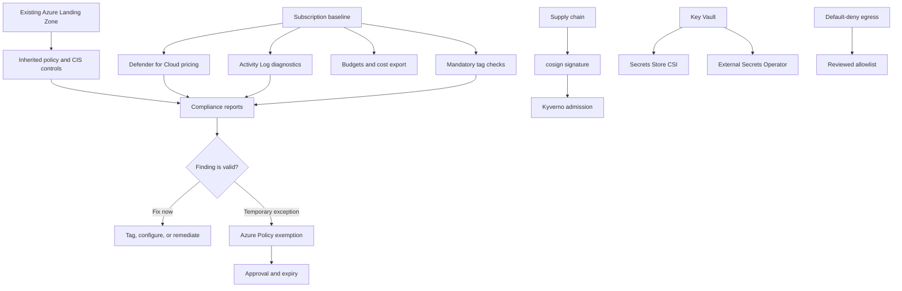
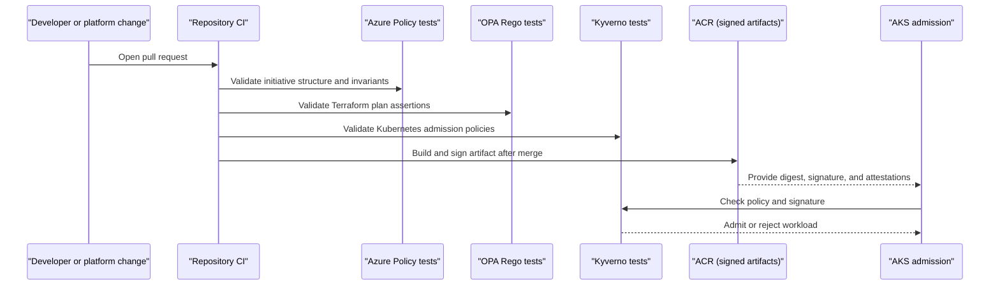

# Security & compliance

Security & compliance is the set of guardrails that keeps the landing zone secure by default while still usable in brownfield Azure tenants. It combines inherited ALZ policy, subscription-scoped hardening, policy-as-code tests, default-deny egress, image provenance, and Key Vault-backed secret delivery.

The capability is cross-cutting. [Azure foundation](./foundation.md) establishes OIDC, state, break-glass, and subscription readiness. [Connectivity & egress](./connectivity-egress.md) adds private networking and outbound controls. Later GitOps and supply chain capabilities enforce Kubernetes admission, signed artifacts, and workload secret patterns.

## How it works

Security controls work as layered enforcement boundaries:

1. The external ALZ owner manages tenant and management-group policy assignments, including broad governance and CIS-aligned controls.
2. This repository does not move subscriptions or weaken inherited assignments. It verifies assumptions and hardens subscriptions after placement.
3. The subscription baseline configures Defender for Cloud plan pricing, Activity Log diagnostics when enabled with an existing central Log Analytics workspace, optional budgets, and optional Cost Management exports.
4. Required tags are enforced through policy expectations and Rego checks so resources carry ownership, environment, cost, product, data classification, confidentiality, management, and repository metadata.
5. Reference Azure Policy initiatives remain in the repository for ALZ administrators and are validated in CI, even when assignment is external.
6. Policy exceptions are Azure Policy exemptions with narrow scope, justification, approval, and expiry. Controls are not disabled globally for one workload.
7. Policy testing is split by engine: Azure Policy for Azure control plane, OPA/Rego for Terraform plan-time assertions, and Kyverno for Kubernetes admission.
8. Kyverno is the only in-cluster admission engine. The AKS Azure Policy Gatekeeper add-on stays disabled unless a future ADR replaces that decision.
9. Supply chain workflows sign images and Helm artifacts with cosign keyless signing, using GitHub OIDC rather than long-lived signing keys.
10. Kyverno verifies signed images before allowing protected workloads to run.
11. Secrets remain in Azure Key Vault. Secrets Store CSI is the default delivery mechanism; External Secrets Operator is allowed only when a Kubernetes `Secret` object is required.
12. Connectivity enforces default-deny egress for non-demo profiles through Azure Firewall Premium. Demo requires the planned Cilium FQDN-aware policy path to be enabled and tested inside AKS because NAT Gateway and base AKS Cilium L3/L4 policy do not filter FQDNs.
13. Break-glass and incident exceptions are time-boxed, detectable, and retro-reviewed.

## Key components

| Component | How it works |
| --- | --- |
| Existing ALZ policy | Tenant and management-group assignments remain outside this repository. The platform consumes them as prerequisites and does not weaken them. |
| Subscription baseline | Applies subscription-scoped hardening: Defender plan pricing, Activity Log diagnostics, optional budget, and optional cost export. |
| Defender for Cloud | Configured per subscription for the plan tiers selected by the baseline inputs. Brownfield subplans and extensions must be preserved unless a security owner approves changes. |
| Activity Log diagnostics | Routes subscription Activity Logs to an existing central Log Analytics workspace only when diagnostics are enabled and the approved workspace ID is supplied. |
| Mandatory tags | Required metadata supports ownership, cost, environment, product, data classification, confidentiality, management, and repository traceability. |
| Reference Azure Policy pack | Optional initiatives for tag baseline, private-link posture, and AKS baseline remain validated for ALZ owners. |
| Azure Policy exemptions | Scoped, time-bound waivers or mitigations are requested and approved as code. |
| OPA/Rego | Validates Terraform plan-time assertions, such as required tag shape. |
| Kyverno | Single in-cluster admission engine for Kubernetes labels, Pod Security, network posture, resource rules, and signed image requirements. |
| Azure Policy for AKS add-on | Not enabled. Kubernetes admission policy is Kyverno-owned. |
| cosign keyless signing | Uses GitHub OIDC to sign container images and Helm OCI artifacts without storing private signing keys. |
| ACR | Stores artifacts, signatures, SBOMs, and attestations beside immutable digests. |
| Secrets Store CSI | Default path for mounting Key Vault-backed secrets and certificates into pods. |
| External Secrets Operator | Approved exception path when a controller or application requires a Kubernetes `Secret`. Key Vault remains the source of truth. |
| Workload Identity | Grants workloads Key Vault access through federated identity and RBAC instead of static credentials. |
| Default-deny egress | Blocks unreviewed outbound paths and requires explicit FQDN or network policy allow rules. |
| Break-glass monitoring | Alerts on emergency account sign-in once Entra diagnostic logs are routed to the monitoring workspace. |

### Profiles

| Profile | Security and compliance behavior |
| --- | --- |
| `demo` | Keeps cost lower, but still uses OIDC, Key Vault-backed secrets, tag expectations, policy tests, and documented exceptions. NAT Gateway replaces Azure Firewall, so FQDN enforcement exists only after the planned Cilium FQDN-aware policy path is enabled and tested in AKS. |
| `nonprod` | Mirrors production guardrails where practical, including Defender, diagnostics, default-deny firewall egress, policy checks, signing, and admission validation. |
| `prod` | Requires the strongest review path: production PIM approval, shorter high-risk exception windows, preserved Defender settings, signed artifacts, private endpoints, and audited break-glass use. |

Security posture is not a single control. Each profile layers identity, policy, network, artifact, admission, and secret controls so one bypass does not silently become broad platform access.

## Decisions

| Decision | Governing ADR |
| --- | --- |
| Compliance is inherited ALZ/CIS policy plus subscription-scoped hardening by this repository. | [ADR-0011: Compliance baseline](../adr/0011-compliance-baseline.md) |
| Temporary non-compliance uses scoped, time-bound Azure Policy exemptions instead of weakening baseline controls. | [ADR-0027: Policy exception workflow and approver matrix](../adr/0027-policy-exception.md) |
| Azure, OPA/Rego, and Kyverno policy tests remain separate because they validate different engines and inputs. | [ADR-0047: Split Azure, OPA/Rego, and Kyverno policy testing](../adr/0047-policy-testing-split.md) |
| Kyverno is the single in-cluster admission engine; Azure Policy Gatekeeper is not installed for AKS. | [ADR-0036: Kyverno is the single in-cluster policy engine](../adr/0036-kyverno-single-engine.md) |
| Container and chart artifacts use cosign keyless signing with GitHub OIDC. | [ADR-0007: Use cosign keyless signing for container and chart artifacts](../adr/0007-image-signing.md) |
| Secrets are delivered from Key Vault through Secrets Store CSI by default, with ESO only when a Kubernetes `Secret` is unavoidable. | [ADR-0006: Default to Secrets Store CSI with ESO as an exception path](../adr/0006-secrets-in-cluster.md) |
| Non-demo egress is default-deny through Azure Firewall Premium, while demo relies on in-cluster FQDN policy. | [ADR-0031: Default-deny egress and FQDN allowlist](../adr/0031-default-deny-egress.md) |
| Break-glass recovery uses two cloud-only accounts with sealed credentials, PIM-eligible Global Administrator access, Conditional Access exclusions, and sign-in alerting. | [ADR-0024: Break-glass procedure and activation alerting](../adr/0024-break-glass.md) |

## Operate it

| Runbook | Use it for |
| --- | --- |
| [Policy exception](../runbooks/policy-exception.md) | Requesting, approving, applying, auditing, and removing time-bound Azure Policy exemptions. |
| [Existing subscription onboarding](../runbooks/subscription-onboarding.md) | Discovering inherited policy, Defender state, diagnostics, provider registration, and mandatory tag gaps before baseline apply. |
| [Secret rotation](../runbooks/secret-rotation.md) | Rotating Key Vault-backed values, coordinating reloads, validating the new version, and preserving rollback windows. |
| [Egress exception workflow](../runbooks/egress-exception.md) | Requesting reviewed outbound access without bypassing default-deny egress. |
| [Bootstrap and secret zero](../runbooks/bootstrap.md) | Wiring OIDC, break-glass alerting, and the first Key Vault and state controls. |

Operate the guardrails with an audit-first mindset:

1. Before onboarding a subscription, run readiness discovery and record inherited policy expectations.
2. If shared destinations are enabled, verify the central Log Analytics workspace and cost export container IDs are approved inputs.
3. Preserve brownfield Defender subplans and extensions unless security approves a downgrade.
4. Fix missing tags directly when possible; use exemptions only when remediation needs time.
5. Keep exemptions narrow, time-bound, and owned by the ALZ policy workflow.
6. Run the engine-specific tests for the surface changed: Azure Policy tests, Rego tests, or Kyverno tests.
7. Never use `conftest` results as proof that Kyverno policies are semantically valid.
8. Keep signing keyless; do not introduce long-lived cosign keys without a new decision.
9. Keep secret material out of Git, workflow variables, Terraform variables, and generated manifests.
10. Review egress and policy exceptions before expiry and remove them through normal pull requests.
11. Treat break-glass use as an incident event with rotation and retro-review.
12. Follow the flow into [Connectivity & egress](./connectivity-egress.md) for network enforcement and [Platform shared services](./platform-services.md) for runtime controls.
