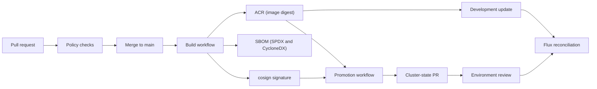
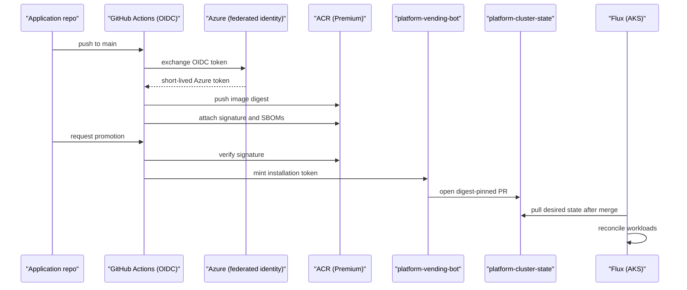

# Supply chain & CI/CD

Supply chain & CI/CD is the paved road for turning source into trusted runtime artifacts. It standardizes how repositories build images, authenticate to Azure, publish evidence, verify signatures, and promote releases without long-lived credentials or direct cluster mutation.

The capability is implemented as reusable GitHub Actions workflows. Application repositories and platform workflows call those workflows rather than re-implementing build, scan, signing, promotion, or TechDocs publishing logic.

## How it works

1. A pull request runs local validation and policy checks.
2. The caller merges to `main` only after review and required checks pass.
3. The build workflow authenticates to Azure with GitHub OIDC.
4. Docker Buildx builds and pushes a multi-architecture image to ACR.
5. The workflow resolves the immutable digest.
6. Trivy scans the digest for high and critical findings.
7. Syft generates SPDX and CycloneDX SBOMs.
8. Cosign signs the digest with keyless GitHub OIDC identity.
9. Cosign attaches SBOM attestations beside the digest in ACR.
10. The lowest environment can move quickly through image automation or generated GitOps PRs.
11. Non-production and production use PR-based promotion.
12. Promotion re-verifies the cosign signature.
13. Promotion writes a digest-pinned Kustomize image update.
14. The workflow opens a PR in `platform-cluster-state`.
15. Flux reconciles after that PR merges.

## Key components

| Component | How it works |
| --- | --- |
| `.github/workflows/container-build-sign.yml` | Builds with Buildx, scans with Trivy, generates SBOMs with Syft, signs and attests the digest with cosign, and publishes the final tag. |
| `.github/workflows/helm-publish.yml` | Packages a Helm chart, pushes it to ACR as an OCI artifact, resolves the digest, and signs the chart artifact. |
| `.github/workflows/promote-image.yml` | Verifies the source image signature, creates a promoted tag, updates Kustomize to a digest reference, and opens a cluster-state PR. |
| `.github/workflows/policy-checks.yml` | Runs Terraform, TFLint, Checkov, Rego, Kyverno, Azure Policy tests, and optional CodeQL. |
| `.github/workflows/gitops-push.yml` | Opens Flux manifest PRs in `platform-cluster-state` using the GitHub App identity. |
| `.github/workflows/techdocs-publish.yml` | Builds TechDocs and uploads them to Azure Storage with OIDC. |
| `workflows/*.yml` | Public workflow contracts that point to the executable workflow files. |
| ACR | Stores images, Helm OCI artifacts, signatures, SBOMs, and attestations. |
| `platform-vending-bot` | Performs cross-repository GitHub writes without PATs. |
| Flux | Applies Kubernetes desired state after reviewed cluster-state merges. |

### Reusable workflow contract

| Caller need | Workflow | Important boundary |
| --- | --- | --- |
| Build a container | `container-build-sign.yml` | Private runner and Azure OIDC variables for ACR access. |
| Publish a chart | `helm-publish.yml` | Private runner and Azure OIDC variables for ACR access. |
| Validate policy | `policy-checks.yml` | PR checks stay read-only unless protected workflows need Azure access. |
| Push Flux manifests | `gitops-push.yml` | GitHub App token from the seed Key Vault. |
| Promote an image | `promote-image.yml` | Trusted builder identity, signature verification, and environment protection. |
| Publish TechDocs | `techdocs-publish.yml` | OIDC upload to the configured storage account. |

Privileged workflows run on the approved private Azure runner labels. That keeps private ACR, private Key Vault, and private state access off arbitrary runners.

### Authentication model

GitHub Actions authenticates to Azure through environment-scoped OIDC federation. Workflows use variables such as client ID, tenant ID, subscription ID, ACR name, and storage account name. They do not use Azure client secrets.

Cross-repository GitHub writes need a separate trust path. OIDC grants Azure access, not write access to another GitHub repository. Workflows read the `platform-vending-bot` private key from the seed Key Vault, mint a short-lived installation token, and use that token to push a branch or open a PR.

The App private key is not committed, stored in GitHub secrets, or written into Terraform state. The bot identity gives a clear audit trail for cluster-state changes.

### Artifact evidence

| Evidence | Tool | Storage or signal |
| --- | --- | --- |
| Digest | Docker Buildx | ACR repository. |
| Vulnerability result | Trivy | CI job result for high and critical findings. The workflow uses `--ignore-unfixed`, so remaining unfixed risk must be reviewed through the release exception path before promotion. |
| SPDX SBOM | Syft | Cosign attestation. |
| CycloneDX SBOM | Syft | Cosign attestation. |
| Signature | cosign keyless | ACR OCI signature artifact. |
| Registry posture | Defender for Containers | Azure security signal after push. |
| Source scanning | CodeQL | Optional GHAS-backed workflow job. |

### Image promotion

| Environment | Behavior | Reason |
| --- | --- | --- |
| `demo` | Same signed artifact path with cost-conscious surrounding services and the fastest update policy. | Public demos still prove the chain of custody. |
| `nonprod` | PR-based promotion with digest pinning and signature re-verification. | Shared testing needs reviewable state. |
| `prod` | Same promotion path with stricter environment reviewers and change controls. | Production changes require approval and immutable evidence. |

`demo` may follow newly signed semver-compatible tags through Flux image automation when configured for fast feedback. `nonprod` and `prod` do not rely on mutable tags. The promoted tag is only a readable alias; the deployable value is the digest.

### Relationship to GitOps and the developer portal

Supply chain & CI/CD builds and verifies artifacts. Kubernetes deployment goes through the GitOps platform capability: workflows open PRs, and Flux reconciles after merge.

The developer portal capability consumes this supply-chain path by creating repositories with the right workflow calls, ownership metadata, TechDocs configuration, and release defaults already present.

## Profiles

| Profile | Supply-chain posture |
| --- | --- |
| `demo` | Signed images, SBOMs, and reusable workflows with lower-cost platform defaults. |
| `nonprod` | Same workflow contracts as production with normal integration review gates. |
| `prod` | Protected environments, required reviewers, digest pins, and signature re-verification. |

## Decisions

| Decision | Effect |
| --- | --- |
| [ADR-0007: Use cosign keyless signing for container and chart artifacts](../adr/0007-image-signing.md) | Uses GitHub OIDC-backed keyless signatures instead of long-lived signing keys. |
| [ADR-0016: PR-based image promotion with digest pinning](../adr/0016-image-promotion.md) | Promotion changes cluster state by reviewed PR and pins digests. |
| [ADR-0019: Layer CI scanning with Trivy, Defender for Containers, CodeQL, and cosign verify](../adr/0019-ci-scanning.md) | Combines CI scanning, registry scanning, optional source scanning, and promotion verification. |
| [ADR-0035: Use Renovate as the primary dependency updater](../adr/0035-dependency-updater-strategy.md) | Renovate handles broad dependency PRs; Dependabot remains for native security alerts. |
| [ADR-0051: Cross-repo GitHub writes](../adr/0051-cross-repo-github-writes.md) | Cross-repo PRs use a GitHub App, not PATs or Terraform file writes. |
| [ADR-0025: GitHub to Azure OIDC federation and a zero-Graph deploy identity](../adr/0025-oidc-federation.md) | Azure access is short-lived, environment-scoped, and secretless. |

## Operate it

| Runbook | Use it for |
| --- | --- |
| [Release and image promotion](../runbooks/release.md) | Build evidence, promotion, smoke tests, exceptions, and rollback. |
| [Renovate dependency updates](../runbooks/renovate.md) | Dependency dashboard triage, update PR review, and urgent CVE handling. |
| [GitHub Advanced Security cost and opt-in](../runbooks/ghas-cost.md) | CodeQL opt-in decisions and GHAS footprint control. |

Operational rules:

1. Do not bypass signature verification for production.
2. Do not deploy to AKS directly from CI as the persistent path.
3. Keep promoted references digest-pinned.
4. Scope scanner exceptions to exact digests or repositories.
5. Rotate the GitHub App private key through the vending process.
6. Use `cosign verify` and `cosign tree` when investigating evidence.
7. Let Flux reconcile after PR merge.
