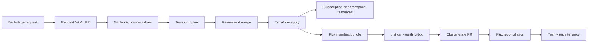
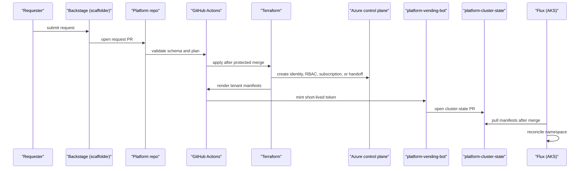
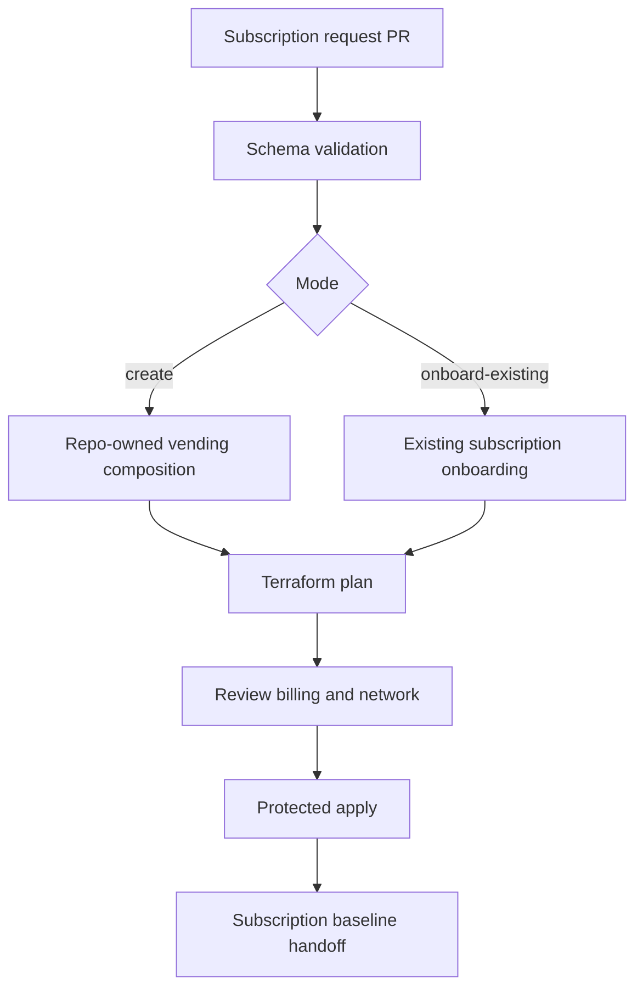
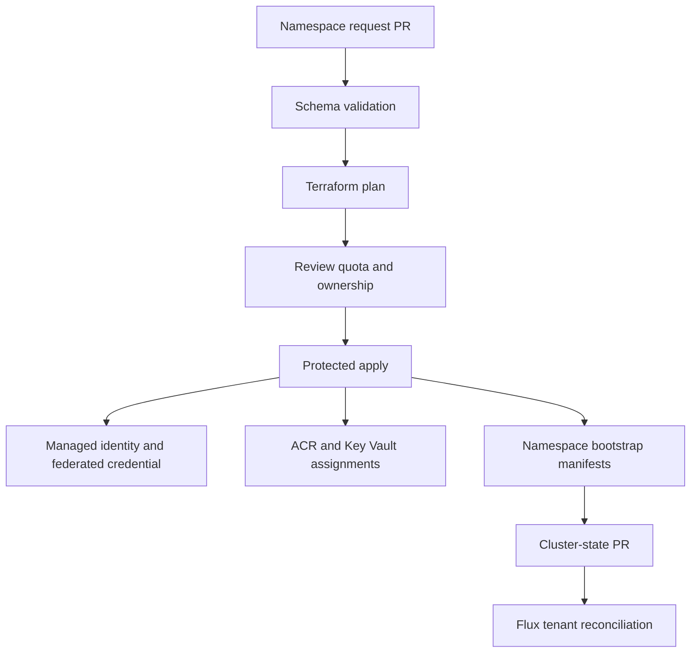

# Tenancy vending & onboarding

Tenancy vending & onboarding turns a team request into governed Azure and Kubernetes tenancy. It supports workload subscriptions for hard isolation and AKS workload namespaces for lower-friction shared-cluster isolation.

Backstage is the friendly entry point, but request YAML, Terraform state, GitHub review, and Flux cluster state are the durable sources of truth.

## How it works

The end-to-end loop is explicit:

1. A user starts in the developer portal capability or submits request YAML directly.
2. Backstage renders a team, subscription, or namespace request and opens a platform repository PR.
3. GitHub Actions validates the request contract.
4. The workflow runs Terraform validation and plan.
5. Platform, security, and finance reviewers approve the PR as required.
6. Merge to `main` runs a protected workflow.
7. Terraform creates or onboards a subscription, or creates namespace-side Azure identity and role resources.
8. Namespace vending renders Flux-compatible manifests.
9. The workflow reads the `platform-vending-bot` key from the seed Key Vault.
10. The bot opens a PR in `platform-cluster-state`.
11. Cluster-state CI validates the generated state.
12. Merge lets the GitOps platform capability reconcile the namespace.
13. The vended tenancy becomes ready for [golden paths](./golden-paths.md).

## Key components

| Component | Purpose |
| --- | --- |
| `docs/contracts/vending-request.schema.json` | Versioned JSON Schema for subscription and namespace requests. |
| `docs/contracts/team-onboarding-request.schema.json` | Separate contract for team onboarding requests, paired with the workflow validator. |
| `docs/contracts/vending-request.yaml` | Example subscription creation request. |
| `docs/contracts/examples/external-subscription-request.yaml` | Example existing-subscription onboarding request. |
| `docs/contracts/examples/namespace-request.yaml` | Example AKS namespace request. |
| `docs/contracts/examples/team-onboarding-request.yaml` | Example team onboarding request. |
| `.github/workflows/vend-subscription.yml` | Validates, plans, and applies subscription creation or onboarding. |
| `.github/workflows/vend-namespace.yml` | Validates, plans, applies namespace Azure resources, and opens the cluster-state PR. |
| `.github/workflows/onboard-team.yml` | Creates or imports team identity and GitHub team resources, then generates namespace requests. |
| `infrastructure/terraform/vending/subscription/` | Repo-owned subscription vending composition. |
| `infrastructure/terraform/vending/onboarding/` | Existing-subscription handoff path. |
| `infrastructure/terraform/vending/aks-namespace/` | Namespace vending module and manifest renderer. |
| `infrastructure/terraform/team-onboarding/` | Team onboarding stack. |
| `platform-vending-bot` | GitHub App for cluster-state writes without PATs. |

### Request contracts

The vending contract covers `SubscriptionVendingRequest` and `NamespaceVendingRequest`. Shared fields include team, product, cost center, on-call rotation, data classification, environment, regions, and mandatory tags.

Team onboarding has a related but separate contract because it creates identity and GitHub team resources before opening namespace requests.

| Request kind | What it handles | Key fields |
| --- | --- | --- |
| `SubscriptionVendingRequest` | Workload subscription creation or existing subscription onboarding. | Mode, billing or existing subscription ID, management group, network, budget, tags. |
| `NamespaceVendingRequest` | AKS workload namespace in the shared platform cluster. | Namespace, Entra group object ID, service account, quota, egress allowlist, platform resource IDs. |
| `TeamOnboardingRequest` | Team identity and initial namespace requests. | Team, GitHub team, product, environments, regions, quota, approved repository permissions. |

The vending schema uses `apiVersion: platform.example.io/v1alpha1` for subscription and namespace requests. CI rejects invalid kinds, missing mandatory fields, future-only fields, unsafe paths, or multiple request changes when workflows require one request per run.

### Subscription vending flow

Subscription vending is brownfield-aware. Tenants with existing Azure Landing Zone vending can keep that process and hand the subscription to onboarding. Tenants where this repository owns creation use the pinned subscription vending composition.

After a subscription exists, subscription baseline owns diagnostics, Defender, budgets, cost export, and tag alignment. Vending does not own tenant-wide management groups or inherited policy.

### AKS namespace vending flow

Namespace vending is the default workload-scope unit when a team does not need a dedicated subscription. It creates the Azure identity and role assignments, then renders the Kubernetes side for Flux.

| Namespace output | Why it exists |
| --- | --- |
| Namespace | Isolates team workloads in shared AKS. |
| ResourceQuota | Bounds CPU, memory, and pod count. |
| RBAC | Scopes team access to the namespace. |
| NetworkPolicy | Starts from default-deny and approved egress. |
| ServiceAccount | Binds workloads to Workload Identity. |
| Federated credential | Avoids static Azure credentials in pods. |
| ACR pull assignment | Allows image pulls from ACR. |
| Key Vault role assignment | Grants only approved secret scopes. |
| Flux Kustomization | Lets Flux own runtime state. |

### Team onboarding flow

1. Backstage collects team, product, cost center, on-call rotation, GitHub team, data classification, environments, and region.
2. The generated `TeamOnboardingRequest` PR validates the team contract and Terraform stack.
3. Merge applies deterministic team onboarding state.
4. Terraform creates or imports `pe-app-team-<name>` and `app-team-<name>`.
5. Repository permissions are limited to approved repositories and permission levels.
6. The workflow opens namespace vending PRs for requested environments.
7. A platform admin maps the new group into Backstage RBAC configuration.
8. The team can execute team-scoped templates.

### Ownership and RBAC

| Artifact | Ownership behavior |
| --- | --- |
| Entra group | `pe-app-team-<name>` is the stable Azure and Backstage team identity. |
| GitHub team | `app-team-<name>` receives explicit repository permissions. |
| Backstage entity | `spec.owner` points to a synced owner. |
| Namespace | Owned by the team, created by vending, reconciled by Flux. |
| Azure resources | Tagged with owner, product, cost center, data classification, managedBy, and repo. |
| Cost data | Aggregates by team, product, and cost center. |

Backstage RBAC uses dynamic Entra group mappings. Repository writers cannot mint privileged Backstage `User` or `Group` entities through catalog YAML.

## Profiles

| Profile | Vending behavior |
| --- | --- |
| `demo` | Low-cost tenancy with the same request, review, and GitOps flow. |
| `nonprod` | Normal request and review path for shared testing. |
| `prod` | Same flow with stricter protection, reviewer, quota, and security review. |

## Decisions

| Decision | Effect |
| --- | --- |
| [ADR-0008: Subscription vending](../adr/0008-subscription-vending.md) | Existing ALZ vending comes first; repo-owned creation is available. |
| [ADR-0033: AKS namespace as workload-scope vending unit](../adr/0033-aks-namespace-vending.md) | Namespaces are the default lower-friction shared AKS unit. |
| [ADR-0034: Vending request schema](../adr/0034-vending-request-schema.md) | YAML requests are public, versioned, and validated. |
| [ADR-0041: Backstage RBAC uses dynamic Entra group mappings](../adr/0041-backstage-rbac.md) | Onboarded groups can be authorized without code changes. |
| [ADR-0043: Ownership matrix is the canonical responsibility document](../adr/0043-ownership-matrix.md) | Responsibilities are traceable across ALZ, Terraform, Flux, Backstage, and teams. |
| [ADR-0029: Custom RBAC roles and group-only assignments](../adr/0029-custom-roles.md) | Access is group-based and least-privilege. |
| [ADR-0051: Cross-repo GitHub writes](../adr/0051-cross-repo-github-writes.md) | Cluster-state PRs use a GitHub App instead of PATs. |

## Operate it

| Runbook | Use it for |
| --- | --- |
| [Environment and subscription vending](../runbooks/vending.md) | GitHub App setup, vending variables, subscription vending, namespace vending, key rotation, and rollback. |
| [Team onboarding](../runbooks/team-onboarding.md) | Team onboarding, idempotency, partial-failure recovery, and smoke tests. |
| [Team decommissioning](../runbooks/team-decommissioning.md) | Retiring teams without orphaned access or ownership. |
| [Existing subscription onboarding](../runbooks/subscription-onboarding.md) | Discovering and onboarding brownfield subscriptions. |
| [Ownership matrix](../runbooks/ownership-matrix.md) | RACI for controlled artifacts. |

Operational rules:

1. Treat Backstage as initiator, not source of truth.
2. Keep requests reviewable as PRs.
3. Do not store the GitHub App private key in GitHub secrets or Terraform state.
4. Do not let teams self-create namespaces outside vending.
5. Use subscription vending for hard isolation needs.
6. Use namespace vending for shared AKS workloads.
7. Do not delete team state until decommissioning validation is complete.
