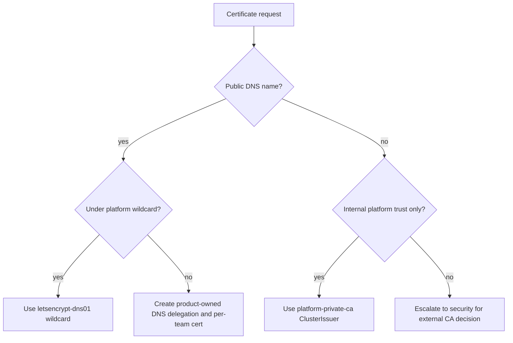

# Certificate management

Stage: 07 - GitOps and in-cluster platform

cert-manager is installed through Flux with two issuer paths: Let's Encrypt
DNS-01 for public hostnames and a Key Vault-backed private CA for internal
platform certificates.

## Issuer choice

## Public certificates

1. Confirm the hostname is covered by `*.<env>.platform.<root-domain>` or an
   approved product-owned DNS delegation.
2. Confirm ExternalDNS owns the target zone and the ingress has the expected
   hostname annotation.
3. Create a `Certificate` that references `letsencrypt-dns01`.
4. Confirm the `CertificateRequest` reaches `Ready=True` and the `Ingress`
   serves the issued certificate.

## Private CA certificates

1. Store `platform-private-ca-crt` and `platform-private-ca-key` in the platform
   Key Vault. The key must be exportable only for this CA sync path.
2. Confirm the cert-manager Workload Identity has Key Vault Secrets User scoped
   to those secret objects.
3. Confirm the `platform-private-ca-sync` Deployment mounts the
   `platform-private-ca` SecretProviderClass and syncs the
   `platform-private-ca` Kubernetes TLS secret in the cert-manager namespace.
4. Create a `Certificate` that references the `platform-private-ca`
   `ClusterIssuer`.
5. Rotate by creating new Key Vault secret versions, waiting for CSI sync, and
   restarting cert-manager.

## Troubleshooting

| Symptom | Check |
|---------|-------|
| DNS-01 challenge pending | ExternalDNS zone permissions, Azure DNS zone name, and cert-manager solver identity. |
| Private issuer not ready | CSI mount/sync status, Key Vault RBAC, and `platform-private-ca` secret type. |
| Rate limit errors | Prefer wildcard reuse, reduce per-host cert churn, and retry after the ACME window. |
