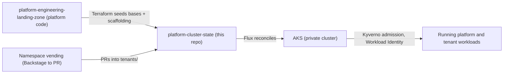

# Platform cluster state

This is the **Flux source of truth** for the Kubernetes desired state of the
Azure Platform Engineering Landing Zone's AKS platform. Flux — installed as the
Microsoft-managed AKS extension — continuously reconciles the live cluster so it
matches what is committed here. Nothing is changed on the cluster by ad hoc
`kubectl`; every change is a reviewed, revertible commit.

It lives in two places. This directory (`platform-gitops/`) in the
[`platform-engineering-landing-zone`](https://github.com/edinc/platform-engineering-landing-zone)
repository is the **source**, and Terraform mirrors it into the separate,
Flux-watched **`platform-cluster-state`** repository. If you are reading this on
`platform-cluster-state`, that is the mirrored copy.

## Why a separate repository?

Platform *code* and cluster *state* are deliberately split to keep blast radius
small:

- The platform repo owns Terraform, CI/CD, policies, Backstage, and templates.
- This repo owns **only** in-cluster Kubernetes state.

A bad cluster change can never break the platform's Terraform state, and a bad
infrastructure change can never silently mutate running workloads. Flux watches
only this repository, so the cluster's desired state has one clear, auditable
source — and application teams receive their namespace manifests here (under
`tenants/`) without touching platform internals.

## How it fits together

1. The platform repo's `cluster-state-repo` Terraform stack seeds and
   drift-reconciles this repository's shared bases, environment scaffolding,
   CODEOWNERS, and the tested Kyverno policy bundle.
2. The Flux extension on AKS points one root Kustomization at
   `clusters/overlays/<profile>` for the cluster's profile (`demo`, `nonprod`,
   or `prod`).
3. Namespace vending opens pull requests that add tenant manifests under
   `tenants/<team>/<env>/`.
4. Flux reconciles the merged state onto the cluster; Kyverno admits it.

## Layout

| Path | Purpose |
| --- | --- |
| `clusters/_base/` | Shared platform add-ons installed by Flux. |
| `clusters/_base/controllers/` | Namespaces, Helm repositories, and controller HelmReleases that establish CRDs. |
| `clusters/_base/addon-config/` | CRD-backed resources and Kyverno policies applied after controllers are ready. |
| `clusters/_base/addon-config/observability/` | Observability, SLO, alerting, and FinOps manifests. |
| `clusters/_base/addon-config/backstage/` | Optional developer-portal (Backstage) deployment and catalog reconciliation. |
| `clusters/overlays/demo` | Demo overlay with cost-conscious defaults. |
| `clusters/overlays/nonprod` | Non-production overlay with enforcement enabled. |
| `clusters/overlays/prod` | Production overlay with HA/security-oriented patches. |
| `tenants/` | Vended team/workload namespace manifests (added via vending PRs). |

## Who owns what

- **Do not hand-edit** the shared bases, environment scaffolding, this README, or
  CODEOWNERS directly on `platform-cluster-state`. They are seeded and
  drift-reconciled by the `infrastructure/terraform/cluster-state-repo` stack in
  the platform repo — change them there (in `platform-gitops/`) so the update
  survives the next Terraform apply.
- **Tenant manifests** under `tenants/` arrive through the namespace-vending
  workflow as reviewed pull requests.

## Operating it

- GitOps model and the `platform-<profile>` Flux source contract:
  [how it works: GitOps platform](https://github.com/edinc/platform-engineering-landing-zone/blob/main/docs/how-it-works/gitops.md)
- Controlled recovery of a stale Flux extension:
  [runbook: flux-extension recovery](https://github.com/edinc/platform-engineering-landing-zone/blob/main/docs/runbooks/flux-extension-recovery.md)
- Namespace vending end to end:
  [runbook: vending](https://github.com/edinc/platform-engineering-landing-zone/blob/main/docs/runbooks/vending.md)

## Conventions

- This repository is **private** and Flux-managed.
- **Never commit secrets, kubeconfigs, or tenant credentials.** Secrets are
  delivered through Key Vault with External Secrets / the Key Vault CSI driver,
  never through Git.
- Keep manifests Flux- and Kustomize-compatible.
