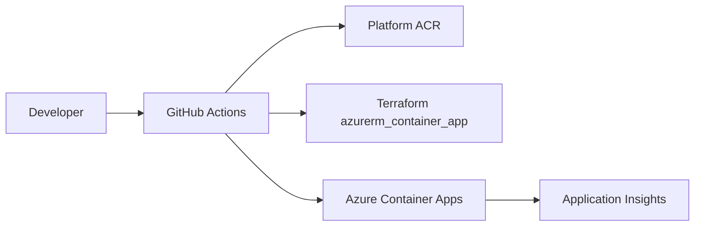

# Architecture

`${{ values.componentId }}` runs as an Azure Container App in the existing Stage
04 managed environment.

Terraform owns the app resource and networking. The CI workflow verifies signed
image digests before using `az containerapp update` for deploy-only revisions.
